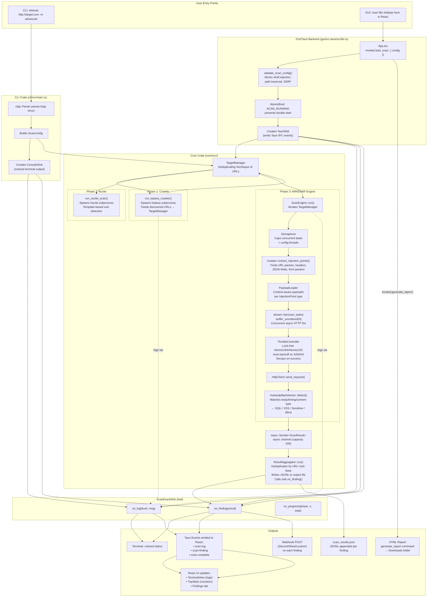

# ARCHITECTURE.md — Arkenar

> **Purpose of this document:** You are the project owner. This file is your single source of truth for how Arkenar is structured, how data moves through it, and what the non-negotiable design rules are. Read this before touching any code.

---

## Table of Contents

1. [High-Level Overview](#1-high-level-overview)
2. [Data Flow Diagram](#2-data-flow-diagram)
3. [Directory Structure Breakdown](#3-directory-structure-breakdown)
4. [The Scan Pipeline (3 Phases)](#4-the-scan-pipeline-3-phases)
5. [The Golden Rules](#5-the-golden-rules)
6. [Key Data Types Reference](#6-key-data-types-reference)
7. [Security Surfaces](#7-security-surfaces)

---

## 1. High-Level Overview

Arkenar is a **Rust workspace** with three crates. Think of them as three different faces of the same product:

| Crate | Path | What it is |
|---|---|---|
| `arkenar-core` | `core/` | The brain. All scan logic lives here. No UI, no CLI parsing. |
| `arkenar-cli` | `cli/` | A thin terminal wrapper. It parses args, builds a `ScanConfig`, and calls `core`. |
| `arkenar-gui` (Tauri) | `gui/src-tauri/` | A thin desktop wrapper. It exposes `core` to a React frontend via IPC commands. |

The React frontend (`gui/src/`) is **not** a Rust crate — it communicates with `arkenar-gui` exclusively through Tauri's IPC bridge.

---

## 2. Data Flow Diagram

This diagram shows the exact path of a scan from user input to final results, for both the CLI and GUI entry points.



---

## 3. Directory Structure Breakdown

> **Rule of thumb used here:** _"If I delete this file, what breaks?"_

### Root

```
arkenr_pr/
├── Cargo.toml            # Workspace definition. Lists the 3 member crates.
├── Cargo.lock            # Pinned dependency versions. Check this in.
├── payloads/             # Payload files loaded by PayloadLoader at runtime.
├── install.sh / .ps1     # One-line installers for end users.
└── tools/                # Bundled tool binaries (Katana, Nuclei) included at build.
```

---

### `core/` — The Brain

```
core/src/
├── lib.rs                # Public API surface of the core crate.
│                           Exports: ScanConfig, ScanEventSink, ConsoleSink,
│                           ScanEngine, ResultAggregator, ScanState, etc.
│                           ⚠️  DELETE THIS → Everything stops compiling.
│
├── core/
│   ├── mod.rs            # Defines the VulnerabilityType enum (SQLi, XSS, etc.)
│   │                       ⚠️  DELETE THIS → No vulnerability classification possible.
│   │
│   ├── engine.rs         # 🔴 THE CORE ENGINE. Owns the scan loop.
│   │                       Creates Semaphore, iterates TargetManager,
│   │                       spawns tokio tasks, uses stream::buffer_unordered
│   │                       for concurrency. Calls mutator → PayloadLoader →
│   │                       ThrottleController → HttpClient → Detector.
│   │                       ⚠️  DELETE THIS → No scanning happens at all.
│   │
│   ├── mutator.rs        # Dissects HTTP requests into InjectionPoints.
│   │                       Handles URL params, headers, JSON fields (recursive),
│   │                       and form-urlencoded params. Produces mutated copies
│   │                       of requests with the payload injected.
│   │                       ⚠️  DELETE THIS → Engine sends no mutated requests.
│   │
│   ├── throttle.rs       # Lock-free rate controller. Uses AtomicU64/AtomicU32
│   │                       exclusively — no Mutex, no contention.
│   │                       Exponential backoff on 429/403, linear decay on success.
│   │                       ⚠️  DELETE THIS → No rate limiting; target servers get flooded.
│   │
│   ├── result_aggregator.rs  # Receives ScanResults from the mpsc channel.
│   │                           Deduplicates (URL base + vuln type as key),
│   │                           calls sink.on_finding(), appends JSONL to disk.
│   │                           ⚠️  DELETE THIS → Findings are never stored or reported.
│   │
│   ├── state.rs          # Crash-resume persistence. Saves ScanState to
│   │                       .arkenar-state.json using atomic write (tmp→rename)
│   │                       to prevent corruption on kill.
│   │                       ⚠️  DELETE THIS → --resume flag stops working.
│   │
│   └── target_manager.rs # Deduplicating FIFO queue (VecDeque + HashSet).
│                           Prevents the same URL from being scanned twice
│                           even when crawler + direct target both report it.
│                           ⚠️  DELETE THIS → Duplicate scans, infinite loops possible.
│
├── http/                 # HttpClient wrapper around reqwest.
│   │                       Handles timeout, proxy, custom headers.
│   │                       ⚠️  DELETE THIS → No HTTP requests can be sent.
│   └── (mod.rs, client.rs)
│
├── modules/
│   ├── crawler.rs        # Wraps Katana (subprocess). Feeds discovered URLs
│   │                       back to the caller for TargetManager ingestion.
│   │                       ⚠️  DELETE THIS → Phase 1 crawling is gone; only direct URLs are scanned.
│   │
│   └── nuclei.rs         # Wraps Nuclei (subprocess). Template-based scanning.
│                           ⚠️  DELETE THIS → Phase 2 template scanning is gone.
│
└── utils/
    ├── detector.rs       # Pattern matching on HTTP response body, timing,
    │                       and content-type to classify vulnerabilities.
    │                       ⚠️  DELETE THIS → Engine fires requests but never detects anything.
    │
    ├── installer.rs      # Downloads and installs Katana + Nuclei binaries.
    │                       Also handles self-update (--update flag).
    │                       ⚠️  DELETE THIS → Tool dependency management breaks.
    │
    ├── payload_loader.rs # Loads payload files from disk. Selects payloads
    │                       contextually per InjectionPoint type.
    │                       ⚠️  DELETE THIS → Engine has no payloads to inject.
    │
    └── mod.rs            # Exports read_lines() helper used by CLI/GUI to
                            load target lists from files.
```

---

### `cli/` — The Terminal Face

```
cli/src/
└── main.rs               # THE ENTIRE CLI. ~309 lines.
                            Parses Args with clap, builds ScanConfig, creates
                            ConsoleSink, calls run_scan_sequence() (3 phases).
                            Also handles --update and --resume.
                            ⚠️  DELETE THIS → arkenar binary doesn't exist.
```

---

### `gui/` — The Desktop Face

```
gui/src-tauri/src/
├── lib.rs                # THE ENTIRE TAURI BACKEND. ~558 lines.
│                           Defines: TauriSink, start_scan, stop_scan,
│                           check_tools, generate_report, test_webhook commands.
│                           Handles input validation, SSRF blocking, AtomicBool
│                           concurrency guards, scan abort logic.
│                           ⚠️  DELETE THIS → GUI has no backend; all IPC calls fail.
│
├── reporting.rs          # Generates HTML report from findings + config.
│                           ⚠️  DELETE THIS → "Export Report" button fails.
│
└── notifications.rs      # send_webhook() — POSTs finding JSON to Discord/Slack/custom.
                            ⚠️  DELETE THIS → Webhook alerts stop working.

gui/src/
├── App.tsx               # ROOT REACT COMPONENT. Sets up Tauri event listeners
│                           (scan-log, scan-finding, scan-complete), manages all
│                           state (config, logs, findings, status), dispatches
│                           invoke() calls to backend.
│                           ⚠️  DELETE THIS → GUI renders nothing.
│
├── types.ts              # Shared TypeScript type definitions (ScanConfig,
│                           LogEntry, ScanFindingEvent, etc.) and DEFAULT_CONFIG.
│                           ⚠️  DELETE THIS → All components lose their type contracts.
│
└── components/
    ├── Sidebar.tsx       # Left panel: all scan configuration inputs + Start/Stop buttons.
    ├── TerminalView.tsx  # Right panel: scrolling log terminal + findings table tabs.
    ├── TopStats.tsx      # Header stats bar: targets, URLs, critical, medium counts.
    └── primitives.tsx    # Reusable micro-components (StatusDot, etc.)
```

---

## 4. The Scan Pipeline (3 Phases)

Every scan — whether launched from CLI or GUI — runs through the **same 3-phase sequence** in `core`. The only difference is the `ScanEventSink` implementation that receives the output.

```
Phase 1: CRAWL
  run_katana_crawler(target, config, sink)
    → spawns Katana subprocess
    → captures discovered URLs
    → adds all URLs to TargetManager

Phase 2: NUCLEI
  run_nuclei_scan(target, mode, verbose, tags, sink)
    → spawns Nuclei subprocess
    → uses template-based CVE/panel/tech detection
    → results logged via sink.on_log()

Phase 3: ARKENAR ENGINE
  ScanEngine::new(target_manager, http_client, threads, rate_limit, payloads)
  engine.run(result_tx)
    → Loop over TargetManager URLs
    → For each URL, acquire Semaphore permit (caps concurrency = threads)
    → extract_injection_points() → list of InjectionPoints
    → For each (InjectionPoint, Payload) pair:
        → mutate_request() → new mutated HttpRequest
        → ThrottleController::wait() → adaptive delay
        → HttpClient::send_request() → HTTP response
        → ThrottleController::record_response() → update backoff
        → VulnerabilityDetector::detect() → Option<VulnerabilityType>
        → If vulnerability found: send ScanResult via mpsc channel
    → All payload tasks run concurrently via stream::buffer_unordered(N)
  
  ResultAggregator::run(result_rx, output_path, sink)
    → Receives ScanResults from channel
    → Deduplicates
    → Calls sink.on_finding() (CLI: colored print / GUI: Tauri event)
    → Appends JSONL to output file
```

---

## 5. The Golden Rules

These are the laws of Arkenar. Violate them and the codebase becomes unmaintainable.

---

### Rule 1: Core is the Only Source of Truth

> **"All new features go into `core`. The GUI and CLI are just wrappers."**

- The `arkenar-core` crate contains **all business logic**: scanning, detection, throttling, persistence, crawling, and reporting.
- `cli/` and `gui/src-tauri/` are **thin adapters**. Their only job is to build a `ScanConfig` and wire up a `ScanEventSink`.
- **If you're adding a new scan technique, a new vulnerability type, a new detection pattern, or a new output format** → it goes in `core/`. Not in `lib.rs` of the GUI, not in `main.rs` of the CLI.
- The validation guards in `gui/src-tauri/src/lib.rs` (`validate_scan_config`) are a **GUI-only security boundary**, not business logic. They stay in the GUI.

**Test:** Ask yourself — "Could the CLI use this feature too?" If yes, it belongs in `core/`.

---

### Rule 2: The ScanEventSink Contract Is Sacred

> **"The engine never prints to stdout. It never emits Tauri events. It only calls the sink."**

The `ScanEventSink` trait in `core/src/lib.rs` is the only output mechanism the engine knows about:

```rust
pub trait ScanEventSink: Send + Sync {
    fn on_log(&self, level: &str, message: &str);
    fn on_finding(&self, result: &ScanResult);
    fn on_progress(&self, phase: &str, current: usize, total: usize);
}
```

- `ConsoleSink` → CLI implementation (colored stdout)
- `TauriSink` → GUI Tauri implementation (IPC events to React)

**Never** import Tauri types into `core/`. **Never** use `println!` in engine code.  
If you want a new output (e.g., a webhook from CLI), **implement a new `ScanEventSink`** — don't touch the engine.

---

### Rule 3: Concurrency is Managed in Three Distinct Layers — Don't Confuse Them

| Layer | Mechanism | What it controls |
|---|---|---|
| **Task cap** | `tokio::sync::Semaphore` | Max number of concurrent tokio tasks targeting URLs |
| **Payload parallelism** | `stream::buffer_unordered(N)` | Max concurrent HTTP requests per URL (payload × injection point) |
| **Rate / backoff** | `ThrottleController` (atomics) | Min time between requests; auto-pauses on 429/403 |

- The `Semaphore` is created in `engine.rs` with capacity = `config.threads`.
- `ThrottleController` uses only `AtomicU64` and `AtomicU32` — **no Mutex, no lock**. This keeps the hot path contention-free.
- **Do not add `Mutex` to `ThrottleController`** — if you need new stats, add an `Atomic`.

---

### Rule 4: Atomic Write for All State Files

> **"Never write directly to a state/output file. Always write to `.tmp`, then rename."**

`ScanState::save()` does this by design:

```rust
let tmp = format!("{}.tmp", path);
fs::write(&tmp, &json)?;
fs::rename(&tmp, path)?;  // atomic on most OS
```

On a crash or kill signal, the previous complete file survives. Only a successful full write results in a rename.  
**Never bypass this pattern** when adding new persistence.

---

### Rule 5: The GUI Backend is a Security Boundary

The Tauri backend (`lib.rs`) performs strict input validation **before** any subprocess is spawned or network call is made:

- `validate_text_field()` — blocks shell metacharacters (`;`, `|`, `&`, backticks, etc.) and path traversal (`../`).
- `validate_tags_field()` — blocks CLI flag injection (`-exec`, `--config`).
- `validate_webhook_url()` — blocks SSRF by requiring HTTPS and rejecting RFC-1918, loopback, and `.local` hosts.
- `AtomicBool SCAN_RUNNING` — prevents a second scan from starting if one is active (compare-and-swap).
- `AtomicBool SCAN_ABORT` — signals the running scan to stop gracefully on `stop_scan` command.

**Do not add new Tauri commands without input validation.** Every user-supplied string is untrusted.

---

## 6. Key Data Types Reference

### `ScanConfig` (`core/src/lib.rs`)

The single struct that carries all configuration from the user to the engine. Both CLI and GUI build one of these and pass it to `core`.

| Field | Default | Purpose |
|---|---|---|
| `target` | `""` | Single URL to scan |
| `list_file` | `""` | Path to a file of URLs (one per line) |
| `mode` | `"simple"` | `"simple"` or `"advanced"` |
| `threads` | `50` | Semaphore capacity / concurrency cap |
| `timeout` | `5` | Per-request timeout in seconds |
| `rate_limit` | `100` | Max requests/sec (enforced by `ThrottleController`) |
| `enable_crawler` | `true` | Toggle Phase 1 (Katana) |
| `enable_nuclei` | `true` | Toggle Phase 2 (Nuclei) |
| `webhook_url` | `None` | HTTPS URL for finding alerts (Discord/Slack/custom) |
| `resume` | `false` | Load `.arkenar-state.json` and continue aborted scan |
| `dry_run` | `false` | Log targets without sending real requests |

### `ScanResult` (`core/src/core/result_aggregator.rs`)

What the engine produces for every confirmed finding. Gets deduplicated, written to disk, and forwarded to the sink.

| Field | Description |
|---|---|
| `url` | The exact URL with injected payload |
| `vuln_type` | E.g. `"SQLi [param: id]"`, `"XSS [json: user.name]"` |
| `payload` | The injected string that triggered the finding |
| `timing_ms` | Response time (used for blind injection detection) |
| `status_code` | HTTP response code |
| `server` | Server header value if present |
| `method` | HTTP method (GET/POST/etc.) |
| `request_headers` | Full request headers at injection time |
| `request_body` | Request body if non-empty |

### `VulnerabilityType` (`core/src/core/mod.rs`)

The canonical enum that `VulnerabilityDetector` returns. It is the only place where new vulnerability _classes_ should be added.

```
SqlInjection       → "SQLi"
BlindSqlInjection  → "Blind SQLi"
Xss                → "XSS"
SensitiveExposure  → "Sensitive Exposure"
Safe               → (filtered out, never reported)
```

---

## 7. Security Surfaces

Understanding where untrusted input enters the system is critical for maintenance.

| Surface | Where | Mitigation |
|---|---|---|
| **User-supplied target URL** | GUI `start_scan` command | `validate_text_field()` + HTTP scheme check |
| **User-supplied list file path** | GUI `start_scan` command | Relative paths only, no leading `/`, `~`, `\` |
| **User-supplied proxy URL** | GUI + CLI | Passed to `reqwest` which handles it; shell injection blocked by validation |
| **User-supplied custom headers** | GUI + CLI | `validate_text_field()` blocks metacharacters |
| **Webhook URL** | GUI `start_scan` + `test_webhook` | `validate_webhook_url()` blocks SSRF, non-HTTPS, and RFC-1918 |
| **Nuclei/Katana tags** | GUI + CLI | `validate_tags_field()` blocks flag injection |
| **HTML report output path** | GUI `generate_report` | Sanitized, canonicalized, must stay inside downloads directory |
| **Payload files** | CLI `--payloads` / GUI `payloads` field | Read from disk by `PayloadLoader`; no shell execution |
| **HTTP response bodies** | Engine `scan_single_request` | Only passed to `VulnerabilityDetector` for pattern matching; never executed |

---

*This document was generated from a full read of the Arkenar source tree. Keep it updated when you add new files, new IPC commands, or new `core` modules.*
