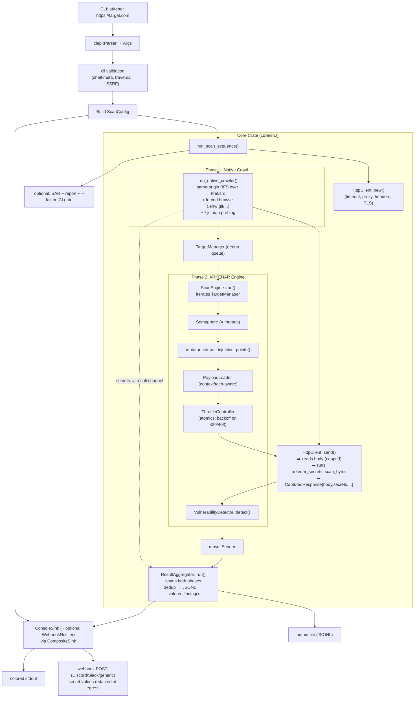

# ARCHITECTURE.md — Arkenar

> **Purpose:** single source of truth for how Arkenar is structured, how data moves
> through it, and the design rules. Read this before touching any code.
>
> **State:** 1.3-era. Pure-Rust, CLI-only, single static binary. The Tauri GUI and the
> Katana/Nuclei external tools were removed. `subfinder` is the **last** external-tool
> wrapper and is being replaced by a native passive enumerator (see `docs/V1.3.md`).

---

## Table of Contents

1. [High-Level Overview](#1-high-level-overview)
2. [Data Flow Diagram](#2-data-flow-diagram)
3. [Directory Structure Breakdown](#3-directory-structure-breakdown)
4. [The Scan Pipeline](#4-the-scan-pipeline)
5. [The Golden Rules](#5-the-golden-rules)
6. [Key Data Types Reference](#6-key-data-types-reference)
7. [Security Surfaces](#7-security-surfaces)

---

## 1. High-Level Overview

Arkenar is a **Rust workspace** with three crates:

| Crate | Path | What it is |
|---|---|---|
| `arkenar-secrets` | `secrets/` | Pure, I/O-free secret detection (regex + entropy + placeholder filtering). The one place secret patterns live. No deps on the other crates. |
| `arkenar-core` | `core/` | The brain. All scan logic: crawling, the engine, detection, throttling, persistence, notifications. No CLI parsing, no UI. |
| `arkenar` (CLI) | `cli/` | The only face. Parses args, builds a `ScanConfig`, wires a `ScanEventSink`, calls `core`. |

Dependency direction: `cli` → `core` → `secrets`. Nothing depends on `cli`.

**No external tools.** Arkenar spawns no Go subprocesses (Katana/Nuclei are gone). The
crawler is native Rust. `subfinder` (recon only) is the sole remaining external wrapper,
pending its native replacement.

---

## 2. Data Flow Diagram


```mermaid
flowchart TD
    CLI_INPUT["CLI: arkenar https://target.com"] --> CLI_ARGS["clap::Parser → Args"]
    CLI_ARGS --> VALIDATE["cli validation\n(shell-meta, traversal, SSRF)"]
    VALIDATE --> CLI_CONFIG["Build ScanConfig"]
    CLI_CONFIG --> SINK["ConsoleSink (+ optional WebhookNotifier)\nvia CompositeSink"]

    CLI_CONFIG --> SEQ["run_scan_sequence()"]

    subgraph CORE[" Core Crate (core/src/)"]
        SEQ --> HTTP["HttpClient::new()\n(timeout, proxy, headers, TLS)"]

        subgraph P1["Phase 1: Native Crawl"]
            CRAWL["run_native_crawler()\nsame-origin BFS over href/src\n+ forced browse (.env/.git/...)\n+ *.js.map probing"]
        end

        subgraph P2["Phase 2: ARKENAR Engine"]
            ENGINE["ScanEngine::run()\niterates TargetManager"]
            SEM["Semaphore (= threads)"]
            MUT["mutator::extract_injection_points()"]
            PAY["PayloadLoader (context/tech-aware)"]
            THR["ThrottleController\n(atomics; backoff on 429/403)"]
            DET["VulnerabilityDetector::detect()"]
        end

        HTTPCLIENT["HttpClient::send()\n⮕ reads body (capped)\n⮕ runs arkenar_secrets::scan_bytes\n⮕ CapturedResponse{body,secrets,...}"]

        SEQ --> CRAWL
        CRAWL --> TM["TargetManager (dedup queue)"]
        TM --> ENGINE
        ENGINE --> SEM --> MUT --> PAY --> THR --> HTTPCLIENT --> DET
        CRAWL --> HTTPCLIENT

        DET --> TX["mpsc::Sender<ScanResult>"]
        CRAWL -. "secrets → result channel" .-> AGG
        TX --> AGG["ResultAggregator::run()\nspans both phases\ndedup → JSONL → sink.on_finding()"]
    end

    AGG --> SINK
    SINK --> TERMINAL["colored stdout"]
    SINK --> WEBHOOK["webhook POST (Discord/Slack/generic)\nsecret values redacted at egress"]
    AGG --> JSONL["output file (JSONL)"]
    SEQ --> SARIF["optional: SARIF report + --fail-on CI gate"]
```

> Note: one `ResultAggregator` is spawned **before Phase 1** and runs across both phases,
> so secrets found during the crawl flow through the same channel — deduped, written to
> the output file, counted in the summary, and printed in near-real-time (the aggregator
> consumes concurrently). The channel closes when both the crawler and engine senders drop.

---

## 3. Directory Structure Breakdown

### Root
```text
ARKENAR/
├── Cargo.toml          # Workspace: members = core, cli, secrets
├── Cargo.lock
├── payloads/           # Payload files loaded by PayloadLoader at runtime
├── install.sh / .ps1   # One-line installers
└── docs/V1.3.md        # The current release plan / north star
```

### `secrets/` — Secret Detection (pure)
```text
secrets/src/lib.rs      # scan_bytes(body, content_type) → Vec<Secret>
                        #   SPECS: regex + optional min-entropy per pattern (AI/cloud
                        #   keys first), RegexSet pre-filter, placeholder rejection,
                        #   content-type gating. No I/O, no async.
                        # ⚠️ The single source of truth for what a "secret" is.
```

### `core/` — The Brain
```text
core/src/
├── lib.rs              # Public API: ScanConfig, ScanEventSink, SinkRef, ConsoleSink,
│                         and re-exports. ⚠️ DELETE → nothing compiles.
├── validation.rs       # SSRF/shell/traversal validators (validate_webhook_url is used
│                         by the webhook notifier). Shared validation helpers.
│
├── core/
│   ├── mod.rs          # VulnerabilityType enum (the canonical finding classes).
│   ├── engine.rs       # 🔴 THE ENGINE. Semaphore + buffer_unordered concurrency;
│   │                     mutator → PayloadLoader → Throttle → HttpClient → Detector.
│   ├── mutator.rs      # Dissects requests into InjectionPoints (URL/header/JSON/form).
│   ├── throttle.rs     # Lock-free rate controller (AtomicU64/U32; backoff/decay).
│   ├── result_aggregator.rs  # ScanResult type; dedup; JSONL write; sink.on_finding().
│   ├── state.rs        # Crash-resume persistence (atomic tmp→rename write).
│   └── target_manager.rs     # Dedup FIFO URL queue (VecDeque + HashSet).
│
├── http/
│   ├── mod.rs          # HttpRequest, BodyType.
│   └── client.rs       # HttpClient. send() is the GLOBAL CHOKE POINT: reads the body
│                         once (capped at MAX_RESPONSE_BODY) and runs the secret filter,
│                         returning CapturedResponse{status,headers,final_url,body,secrets}.
│
├── modules/
│   ├── crawler_native.rs # Native async crawler: same-origin BFS + forced browse of
│   │                       sensitive paths + *.js.map probing. Replaces Katana.
│   ├── dns_lookup.rs   # Async A/MX/TXT/CNAME + raw WHOIS (recon).
│   ├── js_secrets.rs   # Fetches *.js URLs and runs the shared secrets crate on each
│   │                     (already delegates to arkenar_secrets; only JsSecret is local).
│   ├── port_scanner.rs # Async top-1000 TCP connect scan (recon).
│   └── subfinder.rs    # ⚠️ LAST external-tool wrapper (subfinder). Recon only.
│                         Being replaced by native passive enum (V1.3 §2).
│
├── notify/
│   ├── mod.rs          # WebhookNotifier + TelegramNotifier (dormant; not wired into
│   │                     the CLI yet) + CompositeSink (fan-out to multiple sinks).
│   ├── webhook.rs      # build_payload (Discord/Slack/generic), redact_secret, send_webhook.
│   └── telegram.rs     # send_telegram.
│
├── utils/
│   ├── detector.rs     # VulnerabilityDetector: body/timing/content-type/header matching.
│   ├── fingerprint.rs  # TechFingerprinter: tech-stack + WAF from headers/body.
│   ├── installer.rs    # SELF-UPDATE ONLY now (downloads no external tools).
│   ├── payload_loader.rs # Loads + selects payloads per InjectionPoint (tech-aware).
│   └── mod.rs          # read_lines() helper.
│
└── deep-hunter/brain.rs  # JsAnalyzer: extract JS URLs + API endpoints via regex.
```

### `cli/` — The Terminal Face
```text
cli/src/
├── main.rs       # THE CLI. Args (clap), ScanConfig, run_scan_sequence (crawl→engine),
│                   run_recon_sequence (subfinder→ports/DNS), --update, --resume.
├── validation.rs # CLI security boundary: validate_text_field, validate_webhook_url.
└── report.rs     # Severity, SARIF export (--sarif), CI gate (--fail-on).
cli/tests/cli_tests.rs
```

---

## 4. The Scan Pipeline

Every scan runs the **same sequence** in `core`; only the `ScanEventSink` differs.

```text
Phase 1: NATIVE CRAWL  (skippable with --no-crawler)
  run_native_crawler(target, depth, max_urls, same_origin, client, sink, result_tx, abort)
    → same-origin BFS over href/src links
    → forced browse of sensitive paths (.env, .git/config, config.json, .DS_Store, ...)
    → *.js.map probing for each discovered .js
    → every body goes through HttpClient::send() → secret filter
    → secrets → result_tx → ResultAggregator (same channel as the engine)
    → discovered URLs → TargetManager

Phase 2: ARKENAR ENGINE
  ScanEngine::with_config(target_manager, http_client, threads, rate_limit, payloads, config)
  engine.run(result_tx, abort)
    → for each URL: acquire Semaphore permit (cap = threads)
    → extract_injection_points() → [InjectionPoint]
    → for each (point, payload): mutate → Throttle::wait → HttpClient::send
      → secret filter runs on the body; Detector::detect classifies → ScanResult
    → payload tasks run concurrently via stream::buffer_unordered(N)
  ResultAggregator::run(result_rx, output_path, sink)
    → dedup (URL base + vuln type) → sink.on_finding() → append JSONL

Recon mode (--recon): run_recon_sequence(target, sink)
  → subfinder (subdomains) → per-host scan_ports() + resolve_domain()
```

---

## 5. The Golden Rules

### Rule 1: Core is the Only Source of Truth
All business logic lives in `arkenar-core`; secret patterns live in `arkenar-secrets`.
`cli/` is a thin adapter (build a `ScanConfig`, wire a `ScanEventSink`). New scan
technique / detection / output format → it goes in `core` (or `secrets` for patterns).

### Rule 2: The ScanEventSink Contract Is Sacred
```rust
pub trait ScanEventSink: Send + Sync {
    fn on_log(&self, level: &str, message: &str);
    fn on_finding(&self, result: &ScanResult);
    fn on_progress(&self, phase: &str, current: usize, total: usize);
}
```
The engine **never** prints to stdout. It only calls the sink. New output (e.g. a new
alert channel) = a new `ScanEventSink` impl, composed via `CompositeSink` — never a
`println!` in engine code. Implementations: `ConsoleSink`, `WebhookNotifier`,
`TelegramNotifier`, `CompositeSink`.

### Rule 3: Concurrency is Three Distinct Layers
| Layer | Mechanism | Controls |
|---|---|---|
| Task cap | `tokio::sync::Semaphore` | concurrent tasks (= `config.threads`) |
| Payload parallelism | `stream::buffer_unordered(N)` | concurrent requests per URL |
| Rate / backoff | `ThrottleController` (atomics only) | inter-request delay; pause on 429/403 |

Do **not** add a `Mutex` to `ThrottleController` — add an `Atomic`.

### Rule 4: Atomic Write for All State Files
`ScanState::save()` writes `.tmp` then renames. Never write a state/output file in
place. A crash leaves the previous complete file intact.

### Rule 5: One Sovereign Binary — Pure Rust, No External Tools
Arkenar must run a full scan with **no external binary present**. Do not reintroduce a
subprocess dependency (Katana/Nuclei are gone; `subfinder` is the last holdout and is
being removed). New discovery/detection must be native Rust.

### Rule 6: The Secret Filter Has One Home, and Redacts at Egress
All response-body secret detection goes through `arkenar_secrets::scan_bytes`, invoked at
the single choke point `HttpClient::send()`. Don't add ad-hoc secret regexes elsewhere.
Outbound notifications must redact secret values (`notify::redact_secret`).

---

## 6. Key Data Types Reference

### `ScanConfig` (`core/src/lib.rs`)
Carries all configuration from CLI to engine. Selected fields:

| Field | Default | Purpose |
|---|---|---|
| `target` / `list_file` | `""` | single URL / file of URLs |
| `mode` | `"simple"` | `"simple"` or `"advanced"` |
| `threads` | `50` | Semaphore capacity |
| `timeout` | `5` | per-request timeout (s) |
| `rate_limit` | `100` | max req/s (ThrottleController) |
| `enable_crawler` | `true` | Phase 1 toggle (`--no-crawler`) |
| `crawler_depth` / `crawler_max_urls` / `crawler_timeout` | `3` / `50` / `60` | crawl bounds |
| `scope` / `scope_regex` | `false` / `""` | same-origin / regex scope |
| `enable_fingerprint` / `enable_smart_payloads` | `true` | engine toggles |
| `enable_param_fuzz` / `enable_js_analysis` | `false` | discovery toggles |
| `enable_waf_evasion` / `waf_evasion_threshold` | `false` / `5` | evasion on 403s |
| `auth_type` / `auth_token` / `auth_cookies` | `"none"` | auth headers |
| `webhook_url` | `None` | SSRF-validated webhook |
| `allow_insecure_tls` | `false` | accept invalid TLS (dangerous) |
| `resume` / `dry_run` | `false` | resume from state / simulate |

> Removed in 1.3: `tags`, `enable_nuclei`, `nuclei_templates_dir` (Nuclei is gone).

### `ScanResult` (`core/src/core/result_aggregator.rs`)
| Field | Description |
|---|---|
| `url` | URL of the finding (with payload, if any) |
| `vuln_type` | e.g. `"SQLi [param: id]"`, `"Sensitive Exposure [OpenAI API Key]"` |
| `payload` | the injected string / matched secret |
| `timing_ms`, `status_code`, `server`, `method` | response metadata |
| `request_headers`, `request_body` | request at finding time |
| `tech_stack`, `waf_detected` | fingerprint context |
| `verified` | proof flag (being made real in 1.3 §3) |
| `notes` | extra context (e.g. `"secret at line 12"`) |

### `Secret` (`secrets/src/lib.rs`)
`{ kind, matched, line, col }` — produced by `scan_bytes`.

### `VulnerabilityType` (`core/src/core/mod.rs`)
10 variants: `SqlInjection` (SQLi), `BlindSqlInjection` (Blind SQLi), `Xss` (XSS),
`SensitiveExposure` (Sensitive Exposure), `OpenRedirect`, `Ssrf`, `PathTraversal`,
`CommandInjection`, `Rce`, `Safe` (filtered — never reported). New classes go **only**
here.

---

## 7. Security Surfaces

| Surface | Where | Mitigation |
|---|---|---|
| Target URL / proxy / headers | CLI `Args` | `validate_text_field` (shell-meta + `..`) before use |
| List file path | CLI `Args` | `validate_text_field` |
| Webhook URL | CLI + `WebhookNotifier` | `validate_webhook_url`: HTTPS-only, rejects RFC-1918/loopback/`.local`/`.internal` |
| Subfinder domain (recon) | `run_subfinder` | last external subprocess; argument is a validated host (being removed) |
| HTTP response bodies | `HttpClient::send` | passed to `scan_bytes` / `Detector`; never executed; capped at `MAX_RESPONSE_BODY` |
| Outbound finding payloads | `notify::*` | secret values redacted at egress (`redact_secret`) |
| Scope regex | CLI | compiled by `regex` crate — validate to avoid ReDoS |
| TLS | `HttpClient` | `allow_insecure_tls` defaults false; warns loudly when enabled |
| Self-update | `installer.rs` | size-capped download; atomic replace + rollback; **unsigned (warns)** |

---

*Keep this updated when you add files, modules, or `core` types.*
