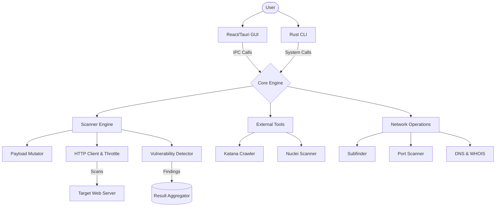
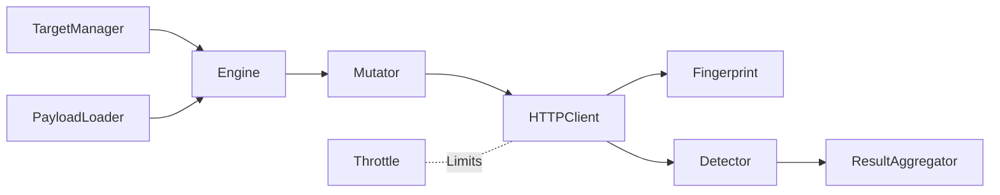
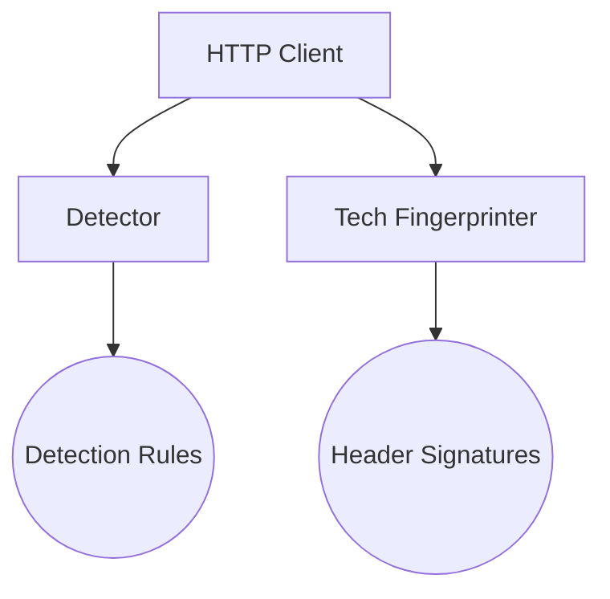
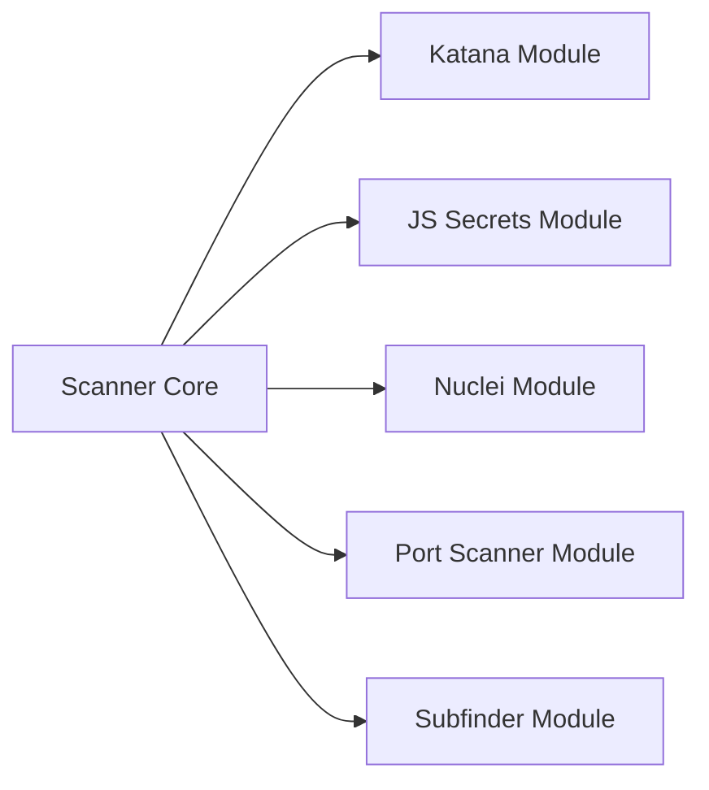

# ARKENAR Project Documentation

This document covers the structure of the ARKENAR project. ARKENAR is a web security scanner made up of three parts: the GUI, the CLI, and the Rust backend (Core).

---

## 1. High-Level Architecture

### 1.1 GUI (Graphical User Interface)
The GUI is the frontend client for the application.
- **Technology Stack**: React, TypeScript, Vite, TailwindCSS, and Tauri.
- **Location**: `gui/`
- **Key Components**:
  - `src/App.tsx / main.tsx`: Application entry points holding top-level state and routing.
  - `src/components/`: React components organizing the interface into panels (Basic Workspace, Recon Workspace, Studio Workspace).
  - `src/store.ts`: State management layer.
- **Purpose**: Uses Tauri IPC to talk to the Rust core, providing real-time log streaming, scan actions, and interactive recon boards.

### 1.2 CLI (Command-Line Interface)
The CLI is the headless entry point for ARKENAR, useful for CI/CD pipelines and automation.
- **Technology Stack**: Rust, Clap.
- **Location**: `cli/`
- **Key Components**:
  - `src/main.rs`: Parses terminal arguments, builds a `ScanConfig`, starts a tokio runtime, and calls the core engine.
  - `src/validation.rs`: Input validation (shell injection and path traversal checks) applied before anything hits the core.

---

## 2. CORE (Rust Backend Engine)

The Core is where all the real work happens. It's written in async Rust using tokio and reqwest, and handles crawling, fingerprinting, payload mutation, and vulnerability detection.

Below is a breakdown of every file and function in `core/src/`.

### 2.1 Core Orchestration & Logic

#### `lib.rs`
System-wide config and event handling definitions.
| Function | Description |
| :--- | :--- |
| `ScanConfig::default()` | Returns a ScanConfig with default values. |
| `ScanConfig::header_list()` | Parses the raw header string into a list of key-value pairs. |
| `ScanConfig::parsed_headers()` | Returns parsed headers after running validation. |
| `ScanConfig::proxy_ref()` | Returns the proxy URL as an `Option<&str>`. |
| `ScanConfig::tags_ref()` | Returns the tags string as an `Option<&str>`. |
| `ScanConfig::auth_headers()` | Builds HTTP auth headers for bearer, cookie, or custom auth modes. |
| `parse_custom_headers()` | Parses raw header strings and rejects any containing shell metacharacters. |
| `ConsoleSink::new_ref()` | Creates an Arc-wrapped ConsoleSink instance. |
| `ConsoleSink::on_log()` | Prints a styled log line to stdout. |
| `ConsoleSink::on_finding()` | Prints a finding with severity color to stdout. |
| `ConsoleSink::on_progress()` | Prints a progress line to stdout. |

#### `validation.rs`
Input validation before anything reaches system calls.
| Function | Description |
| :--- | :--- |
| `validate_text_field()` | Rejects strings containing shell metacharacters or path traversal sequences. |
| `validate_tags_field()` | Rejects strings that look like CLI flags (e.g. `--config`). |
| `validate_webhook_url()` | Ensures the webhook URL is HTTPS and not pointing at a private or loopback address. |

#### `core/mod.rs`
Defines vulnerability structures and module paths.
| Function | Description |
| :--- | :--- |
| `VulnerabilityType::fmt()` | Maps each variant to its human-readable label (e.g. `SQLi`, `XSS`). |

#### `core/engine.rs`
The main scan loop.
| Function | Description |
| :--- | :--- |
| `ScanEngine::new()` | Creates a ScanEngine with explicit parameters. |
| `ScanEngine::with_config()` | Creates a ScanEngine from a ScanConfig. |
| `ScanEngine::run()` | Main scan loop. Iterates the target queue, spawns async tasks, and returns the total URL count. |
| `ScanEngine::scan_request()` | Injects a custom HttpRequest directly into the test pipeline. |
| `create_request_from_url()` | Builds a basic GET HttpRequest from a URL string. |
| `extract_server()` | Pulls the Server header value from a response. |
| `headers_to_vec()` | Converts a reqwest HeaderMap to a `Vec<(String, String)>`. |
| `read_body_capped()` | Reads the response body up to a size cap to avoid OOM issues. |
| `scan_single_request()` | Builds injection points for a request and fires all payload variants concurrently. |
| `format_vuln_type()` | Formats a finding with its injection point, e.g. `SQLi [param: id]`. |
| `basic_scan()` | Sends the request unchanged to collect a baseline response. |

#### `core/mutator.rs`
Mutates request structures to inject payloads.
| Function | Description |
| :--- | :--- |
| `build_canary_request()` | Appends a canary query param to detect reflected input before firing real payloads. |
| `get_blacklisted_headers()` | Returns headers that should never be fuzzed (Host, Content-Length, etc.). |
| `extract_json_paths_recursive()` | Recursively walks a JSON value to collect all leaf node paths. |
| `extract_injection_points()` | Maps all injectable spots in a request: URL params, headers, form body, JSON fields. |
| `tokenize_json_path()` | Converts a dot-path string into a list of access keys or indices. |
| `inject_into_json()` | Entry point for JSON injection — resolves the path and inserts the payload. |
| `inject_into_json_recursive()` | Recursively traverses JSON to replace the target leaf. |
| `inject_payload_into_value()` | Replaces a JSON leaf value with the payload regardless of its original type. |
| `mutate_request()` | Routes a mutation to the right handler based on injection point type. |
| `mutate_url_param()` | Replaces a specific URL query parameter value with the payload. |
| `mutate_header()` | Replaces a specific request header value with the payload. |
| `mutate_json_field()` | Parses the body as JSON and injects the payload at the specified path. |
| `mutate_form_param()` | Replaces a form-urlencoded parameter value with the payload. |
| `update_content_length()` | Recalculates Content-Length after the body has been mutated. |

#### `core/result_aggregator.rs`
Handles and catalogs findings from the scan channel.
| Function | Description |
| :--- | :--- |
| `ScanResult::to_curl()` | Converts a finding into a copy-pasteable curl command. |
| `shell_quote()` | Shell-quotes a string to prevent terminal injection. |
| `build_dedup_key()` | Produces a deduplication key from URL base and vuln type. |
| `ResultAggregator::run()` | Reads from the finding channel, deduplicates, writes JSONL to disk, and calls `sink.on_finding()`. |
| `ResultAggregator::report_summary()` | Prints a count summary grouped by severity. |

#### `core/state.rs`
Crash-resume state persistence.
| Function | Description |
| :--- | :--- |
| `ScanState::new()`, `default_path()`, `delete()`, `exists()` | Standard constructors and helpers for scan state. |
| `ScanState::save()` | Writes state to disk atomically via a temp file and rename. |
| `ScanState::load()` | Reads and deserializes state from disk. |
| `ScanState::checkpoint()` | Appends the current target to the visited list and saves. |
| `now_iso()` | Returns the current time as an ISO 8601 string. |

#### `core/target_manager.rs`
Deduplicating URL queue.
| Function | Description |
| :--- | :--- |
| `TargetManager::new()` | Creates an empty target queue. |
| `TargetManager::add_target()` | Adds a URL to the queue, skipping it if already seen. |
| `TargetManager::pop_next()` | Pops the next URL from the queue, or `None` if empty. |
| `TargetManager::len()`, `total_seen()`, `is_empty()` | Queue length and state helpers. |

#### `core/throttle.rs`
Lock-free request rate control.
| Function | Description |
| :--- | :--- |
| `ThrottleController::new()` | Creates a rate controller with the specified requests-per-second limit. |
| `ThrottleController::wait()` | Sleeps until the minimum inter-request delay has elapsed. |
| `ThrottleController::record_response()` | Updates backoff state based on the HTTP status code — backs off on 429/403, decays on success. |
| `ThrottleController::current_delay_ms()`, `total_throttled()` | Returns current delay and total throttle time stats. |

---

### 2.2 Intelligence & Fingerprinting

#### `utils/detector.rs`
Pattern matching on HTTP responses to classify vulnerabilities.
| Function | Description |
| :--- | :--- |
| `VulnerabilityDetector::new()` | Creates a detector with compiled detection patterns. |
| `VulnerabilityDetector::detect()` | Checks a response for SQL errors, XSS reflection, redirects, timing anomalies, and sensitive content. |
| `VulnerabilityDetector::is_xss_payload()` | Returns true if the payload string looks like an XSS vector. |
| `VulnerabilityDetector::is_open_redirect_payload()` | Returns true if the payload is a redirect test string. |
| `VulnerabilityDetector::has_sensitive_patterns()` | Checks the response body for known sensitive data patterns. |
| `VulnerabilityDetector::is_sql_vulnerable()`, `is_xss_vulnerable()`, `is_sensitive_file_found()` | Individual checks for SQL errors, XSS reflection, and sensitive file exposure in a response. |

#### `utils/fingerprint.rs`
Identifies the tech stack and WAFs from response headers and body.
| Function | Description |
| :--- | :--- |
| `FingerprintResult::summary()` | Returns a short string listing detected technologies. |
| `FingerprintResult::is_empty()` | Returns true if no technologies were detected. |
| `TechFingerprinter::new()` | Creates a fingerprinter with compiled header signature rules. |
| `TechFingerprinter::analyze()` | Inspects response headers and body to identify the tech stack and WAFs. |
| `push_unique()` | Appends a value to a vec only if it isn't already present. |

#### `deep-hunter/brain.rs`
Extracts JS URLs and API endpoints from page source.
| Function | Description |
| :--- | :--- |
| `re_js_src()`, `re_js_import()`, `re_fetch()`, `re_axios()`, `re_route()` | Compiled regex patterns for matching JS source URLs, imports, fetch calls, axios calls, and routes. Cached via `OnceLock`. |
| `JsAnalyzer::new()` | Creates a JS analyzer for a given base URL. |
| `JsAnalyzer::extract_js_urls()` | Finds all script src references in a page. |
| `JsAnalyzer::extract_endpoints()` | Extracts API endpoints from JS source using regex patterns. |

---

### 2.3 External Dependency Management

#### `utils/installer.rs`
Downloads and manages Katana, Nuclei, and Arkenar itself.
| Function | Description |
| :--- | :--- |
| `get_arkenar_asset_name()`, `get_arkenar_binary_name()`, `get_tool_binary_name()` | Returns the expected file and binary names for the current platform. |
| `expected_hash_for()` | Returns the expected SHA-256 hash for a tool binary on the current platform. |
| `sha256_hex()` | Computes the SHA-256 hex digest of a byte slice. |
| `get_tool_download_url()` | Builds the GitHub release download URL for a tool on the current platform. |
| `get_arkenar_home()`, `get_plugin_dir()`, `default_nuclei_templates_dir()` | Returns paths to the Arkenar home and plugin directories. |
| `ensure_plugin_dirs()` | Creates the plugin directories if they don't already exist. |
| `check_and_install_tools()` | Checks whether Katana and Nuclei are installed and downloads them if not. |
| `run_full_update()`, `update_nuclei()`, `update_nuclei_templates()`, `update_katana()` | Update routines for Arkenar and its external tools. |
| `self_update()` | Downloads the latest Arkenar release binary and replaces the running one. |
| `extract_binary_from_tar_gz()`, `extract_binary_from_zip()` | Extracts the target binary from a tar.gz or zip archive. |
| `download_and_extract()` | Downloads a tool release archive and extracts the binary. |

#### `utils/payload_loader.rs`
Loads payloads from disk and selects them contextually.
| Function | Description |
| :--- | :--- |
| `PayloadLoader::new()`, `load()`, `load_with_extra()`, `load_from_paths()` | Constructors that load payload lists from disk. |
| `xss_payloads()`, `sqli_payloads()`, `path_traversal_payloads()`, `all_payloads()` | Returns the payload list for the given category. |
| `contextual_payloads()` | Picks payloads based on the parameter name (e.g., `id` → SQLi payloads). |
| `get_payloads_for_point()`, `get_payloads_for_point_tech_aware()` | Returns payloads for an injection point, optionally filtered by detected tech stack. |
| `get_all_polyglots()`, `payload_count()`, `total_payload_count()` | Returns polyglot payloads and payload count stats. |
| `load_list_from_file()` | Reads a payload list from a file on disk. |

---

### 2.4 Extensible Modules (`core/src/modules/`)

#### `modules/crawler.rs`
Wraps Katana to discover URLs.
| Function | Description |
| :--- | :--- |
| `KatanaOutput::extract_url()` | Parses a URL from a Katana JSON output line. |
| `katana_binary()` | Returns the path to the Katana binary. |
| `run_katana_crawler()` | Spawns Katana and feeds discovered URLs into the target manager. |

#### `modules/dns_lookup.rs`
| Function | Description |
| :--- | :--- |
| `resolve_domain()` | Resolves A, MX, TXT, CNAME records and fetches WHOIS for a domain. |
| `fetch_whois()` | Makes a raw TCP connection to a WHOIS server and returns the response. |

#### `modules/js_secrets.rs`
| Function | Description |
| :--- | :--- |
| `patterns()` | Compiles regex patterns for detecting AWS keys, GitHub tokens, JWTs, and other secrets. |
| `scan_js_secrets()` | Downloads a JS URL and runs secret patterns against its content. |

#### `modules/nuclei.rs`
| Function | Description |
| :--- | :--- |
| `validate_path_field()` | Rejects template paths containing traversal sequences. |
| `parse_template()` | Parses a Nuclei template YAML path. |
| `run_nuclei_scan()` | Spawns a Nuclei subprocess and streams its output through the event sink. |

#### `modules/port_scanner.rs`
| Function | Description |
| :--- | :--- |
| `scan_ports()` | Concurrently tries TCP connections to the top 1000 ports and returns the open ones. |

#### `modules/subfinder.rs`
| Function | Description |
| :--- | :--- |
| `run_subfinder()` | Spawns Subfinder and feeds discovered subdomains into the target manager. |

--- 

*This documentation should be updated as the architecture evolves.*
