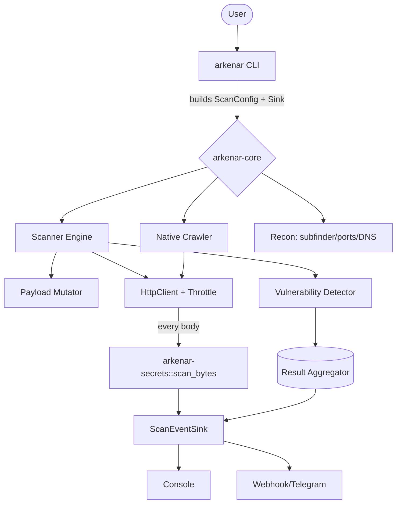

# ARKENAR Project Documentation

ARKENAR is a pure-Rust, terminal-native offensive web scanner (DAST). It is a Cargo
workspace of **three crates**: `arkenar-secrets` (pure secret detection), `arkenar-core`
(all scan logic), and `arkenar` (the CLI). There is **no GUI** and **no external tools**
— the Tauri desktop app and the Katana/Nuclei subprocesses were removed in 1.3.
`subfinder` is the last external wrapper (recon only) and is being replaced by a native
enumerator.

---

## 1. High-Level Architecture

### 1.1 CLI (`arkenar`, `cli/`)
The single entry point. Rust + Clap.
- `src/main.rs` — parses args, validates, builds `ScanConfig`, wires a `ScanEventSink`,
  runs the scan or recon sequence; handles `--update` and `--resume`.
- `src/validation.rs` — input validation (shell-meta/traversal, webhook SSRF).
- `src/report.rs` — severity model, SARIF export (`--sarif`), CI gate (`--fail-on`).

### 1.2 Core (`arkenar-core`, `core/`)
All scan logic, async Rust on tokio + reqwest. Detailed below.

### 1.3 Secrets (`arkenar-secrets`, `secrets/`)
Pure, I/O-free secret detection — shared by the crawler and the engine through the
`HttpClient` choke point.

---

## 2. SECRETS crate (`secrets/src/lib.rs`)

The single source of truth for what a "secret" is. No I/O, no async.

| Item | Description |
| :--- | :--- |
| `Secret` | `{ kind, matched, line, col }` — a single detected secret. |
| `scan_bytes(body, content_type)` | Scans a body for secrets. Content-type gates out binary; a `RegexSet` pre-filters; each match is placeholder-filtered and entropy-gated per its `Spec`. Returns deduped `Vec<Secret>`. |
| `SPECS` (internal) | The pattern table: AI/cloud keys first (OpenAI, Anthropic, HF, Stripe, AWS, GitHub, Google, Slack…), private keys, JWTs, generic hardcoded secrets — each with an optional min-entropy. |

---

## 3. CORE crate (`arkenar-core`)

### 3.1 Orchestration & Config

#### `lib.rs`
| Function | Description |
| :--- | :--- |
| `ScanConfig::default()` | Default config values. |
| `ScanConfig::header_list()` | Splits the raw header string into a list. |
| `ScanConfig::parsed_headers()` | Parsed, validated header key-value pairs. |
| `ScanConfig::proxy_ref()` | Proxy URL as `Option<&str>`. |
| `ScanConfig::auth_headers()` | Builds auth headers for bearer/cookie/custom modes. |
| `parse_custom_headers()` | Parses headers, rejecting shell metacharacters. |
| `ConsoleSink::new_ref()` / `on_log` / `on_finding` / `on_progress` | The CLI sink: styled stdout. |
| `ScanEventSink` (trait) | The only output contract the engine knows. |

> `tags_ref()` was removed in 1.3 along with Nuclei.

#### `validation.rs`
| Function | Description |
| :--- | :--- |
| `validate_text_field()` | Rejects shell metacharacters / path traversal. |
| `validate_tags_field()` | Rejects flag-injection in comma lists (helper; retained). |
| `validate_webhook_url()` | Requires HTTPS; rejects private/loopback hosts (SSRF). Used by the webhook notifier. |

#### `core/mod.rs`
| Function | Description |
| :--- | :--- |
| `VulnerabilityType::fmt()` | Maps each of the 10 variants to its label (e.g. `SQLi`). |

#### `core/engine.rs`
| Function | Description |
| :--- | :--- |
| `ScanEngine::new()` / `with_config()` | Construct the engine (explicit / from `ScanConfig`). |
| `ScanEngine::run()` | Main loop: iterate targets, spawn tasks, return URL count. |
| `ScanEngine::scan_request()` | Inject a custom `HttpRequest` into the pipeline. |
| `scan_single_request()` | Builds injection points and fires payload variants concurrently. |
| `basic_scan()` | Sends a request unchanged (baseline); still runs the secret filter. |
| `secret_to_result()` | Wraps a detected `Secret` into a `ScanResult`. |
| `format_vuln_type()` | Formats a finding with its injection point. |
| `create_request_from_url()` / `extract_server()` / `headers_to_vec()` | Helpers. |

#### `core/mutator.rs`
| Function | Description |
| :--- | :--- |
| `extract_injection_points()` | Finds all injectable spots: URL params, headers, form, JSON. |
| `mutate_request()` + `mutate_url_param/header/json_field/form_param()` | Apply a payload at a point. |
| `build_canary_request()` | Reflection canary before real payloads. |
| `extract_json_paths_recursive()` / `tokenize_json_path()` / `inject_into_json*()` / `inject_payload_into_value()` | Recursive JSON injection. |
| `get_blacklisted_headers()` / `update_content_length()` | Safety + bookkeeping helpers. |

#### `core/result_aggregator.rs`
| Function | Description |
| :--- | :--- |
| `ScanResult` (struct) | The finding record (see ARCHITECTURE §6). |
| `ScanResult::to_curl()` | Renders a copy-pasteable curl. |
| `shell_quote()` | Shell-quotes to prevent terminal injection. |
| `build_dedup_key()` | Dedup key from URL base + vuln type. |
| `ResultAggregator::run()` | Reads the channel, dedups, previews each finding live via `sink.on_finding()`. |
| `ResultAggregator::write_results_file()` | Persists the final result set to JSONL — called *after* `--verify-live`, so the file reflects final verification tiers. |

#### `core/state.rs`
| Function | Description |
| :--- | :--- |
| `ScanState::new/default_path/delete/exists` | State helpers. |
| `ScanState::save()` | Atomic write (tmp → rename). |
| `ScanState::load()` | Deserialize from disk. |
| `ScanState::checkpoint()` | Append visited target + save. |
| `now_iso()` | Current time as ISO 8601. |

#### `core/target_manager.rs`
| Function | Description |
| :--- | :--- |
| `TargetManager::new/add_target/pop_next/len/total_seen/is_empty` | Deduplicating FIFO URL queue. |

#### `core/throttle.rs`
| Function | Description |
| :--- | :--- |
| `ThrottleController::new()` | Rate controller for a given req/s. |
| `ThrottleController::wait()` | Sleep the minimum inter-request delay. |
| `ThrottleController::record_response()` | Backoff on 429/403, decay on success. |
| `current_delay_ms()` / `total_throttled()` | Stats. |

### 3.2 HTTP (`http/`)

#### `http/mod.rs`
| Item | Description |
| :--- | :--- |
| `HttpRequest`, `BodyType` | Request model and body-type enum. |

#### `http/client.rs`
| Function | Description |
| :--- | :--- |
| `CapturedResponse` (struct) | `{ status, headers, final_url, body, secrets }`. |
| `HttpClient::new()` | Builds the reqwest client (timeout, proxy, headers, TLS, UA rotation). |
| `HttpClient::send_request()` | Sends a request, returns the raw `Response`. |
| `HttpClient::send()` | **Choke point:** sends, reads the capped body once, runs `scan_bytes`, returns `CapturedResponse`. |
| `get()` / `get_with_user_agent()` / `get_with_custom_headers()` | Convenience GETs. |

### 3.3 Detection & Intelligence (`utils/`)

#### `utils/detector.rs`
| Function | Description |
| :--- | :--- |
| `VulnerabilityDetector::new()` | Construct the detector. |
| `VulnerabilityDetector::detect()` | Classifies a response: SQL errors, XSS reflection, open redirect, blind timing, path traversal. Secret/sensitive-exposure detection is **not** here — it goes through `arkenar_secrets::scan_bytes` at the HTTP choke point. |
| `is_xss_payload()` / `is_open_redirect_payload()` | Predicate helpers. |
| `is_sql_vulnerable()` / `is_xss_vulnerable()` | Individual checks. |

#### `utils/fingerprint.rs`
| Function | Description |
| :--- | :--- |
| `TechFingerprinter::new()` / `analyze()` | Identify tech stack + WAF from headers/body. |
| `FingerprintResult::summary()` / `is_empty()` / `push_unique()` | Result helpers. |

#### `utils/payload_loader.rs`
| Function | Description |
| :--- | :--- |
| `PayloadLoader::new/load/load_with_extra/load_from_paths` | Load payload lists from disk. |
| `xss_payloads/sqli_payloads/path_traversal_payloads/all_payloads` | Category accessors. |
| `contextual_payloads()` | Picks payloads by parameter name. |
| `get_payloads_for_point()` / `get_payloads_for_point_tech_aware()` | Per-injection-point selection. |
| `get_all_polyglots()` / `payload_count()` / `total_payload_count()` | Stats. |

#### `utils/installer.rs` — self-update only
| Function | Description |
| :--- | :--- |
| `run_full_update()` | Entry for `--update`; runs the self-update. |
| `self_update()` | Downloads the latest ARKENAR release (size-capped), atomically replaces the binary, rolls back on failure. **Unsigned — warns.** |
| `get_arkenar_asset_name()` / `get_arkenar_binary_name()` | Platform asset/binary names. |
| `extract_binary_from_tar_gz()` / `extract_binary_from_zip()` | Archive extraction. |

> All Katana/Nuclei download + update routines and hash-pinning were removed in 1.3.

#### `deep-hunter/brain.rs`
| Function | Description |
| :--- | :--- |
| `JsAnalyzer::new/extract_js_urls/extract_endpoints` | Find script srcs and API endpoints in page/JS source. |
| `re_js_src/re_js_import/re_fetch/re_axios/re_route` | Cached regex patterns. |

### 3.4 Modules (`core/src/modules/`) — all native except `subfinder`

#### `modules/crawler_native.rs` — replaces Katana
| Function | Description |
| :--- | :--- |
| `run_native_crawler()` | Same-origin BFS over `href/src` + forced browse + `*.js.map` probing; emits secrets per body via the sink; returns discovered URLs. |
| `fetch_links()` / `fetch_probe()` | Fetch a page (collect links) / a forced-browse probe. |
| `emit_secrets()` | Emits `CapturedResponse.secrets` as findings. |
| `extract_links()` / `in_scope()` / `build_probes()` / `dir_of()` | Link parsing, scoping, probe-set construction. |

#### `modules/dns_lookup.rs`
| Function | Description |
| :--- | :--- |
| `resolve_domain()` | Resolves A/MX/TXT/CNAME + WHOIS. |
| `fetch_whois()` | Raw TCP WHOIS query. |

#### `modules/js_secrets.rs`
| Item | Description |
| :--- | :--- |
| `JsSecret` (struct) | `{ url, secret_type, matched_value, line_number }`. |
| `scan_js_secrets()` | Fetches `.js` URLs and runs the shared `arkenar_secrets::scan_bytes` on each (already delegates to the secrets crate — only the `JsSecret` wrapper type is local). |

#### `modules/port_scanner.rs`
| Function | Description |
| :--- | :--- |
| `scan_ports()` | Concurrent top-1000 TCP connect scan (recon). |

#### `modules/subfinder.rs` — last external wrapper
| Function | Description |
| :--- | :--- |
| `run_subfinder()` | Spawns `subfinder` for passive subdomain enumeration (recon only). Being replaced by a native passive enumerator. |

### 3.5 Notifications (`notify/`)

#### `notify/mod.rs`
| Function | Description |
| :--- | :--- |
| `WebhookNotifier::new()` / `flush()` | A `ScanEventSink` that queues findings and POSTs them async; `flush` drains before exit. |
| `TelegramNotifier::new()` / `flush()` | Same pattern for Telegram. **Dormant — not wired into the CLI yet.** |
| `CompositeSink::new_ref()` | Fan-out sink (e.g. console + webhook). |

#### `notify/webhook.rs`
| Function | Description |
| :--- | :--- |
| `build_payload()` | Formats Discord embeds / Slack blocks / generic JSON by host. |
| `redact_secret()` | Redacts secret values before egress. |
| `send_webhook()` | POSTs the payload. |

#### `notify/telegram.rs`
| Function | Description |
| :--- | :--- |
| `send_telegram()` | Sends a finding to a Telegram chat via bot. |

---

## 4. CLI crate (`arkenar`)

#### `cli/src/main.rs`
| Item | Description |
| :--- | :--- |
| `Args` | Clap argument model. |
| `run_scan_sequence()` | Phase 1 native crawl → Phase 2 engine → aggregate. |
| `run_recon_sequence()` | subfinder → per-host ports + DNS. |
| `print_banner()` / `print_scan_config()` | Output chrome. |

#### `cli/src/validation.rs`
`validate_text_field()`, `validate_webhook_url()` — CLI security boundary.

#### `cli/src/report.rs`
| Item | Description |
| :--- | :--- |
| `Severity` (+ `parse`) | Severity model for findings. |
| `to_sarif()` | Builds a SARIF report (`--sarif`, GitHub Security tab). |
| `gate()` | CI gate: true if any finding is at/above the `--fail-on` threshold. |

---

*Update this as the architecture evolves.*
