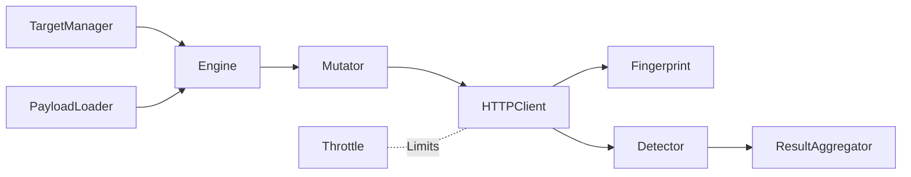
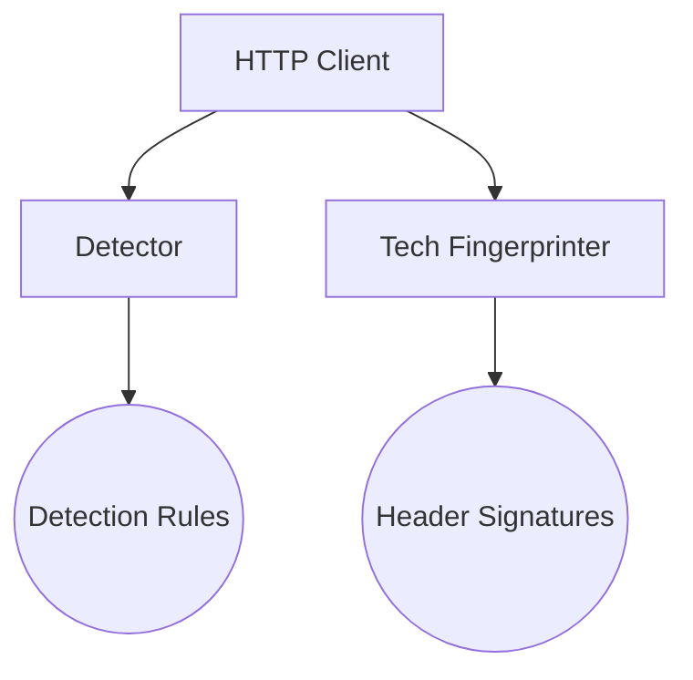
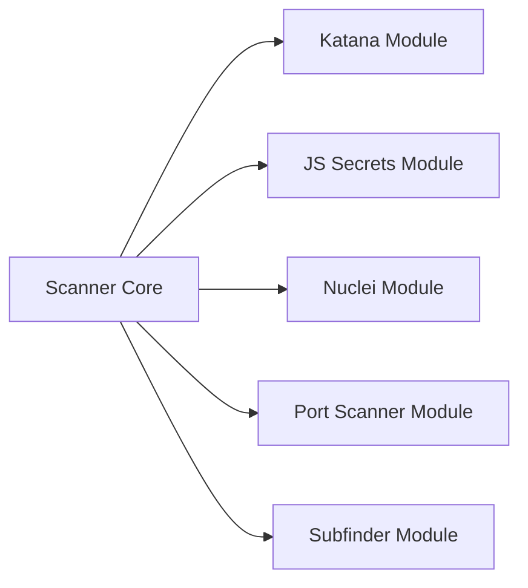

# ARKENAR Project Documentation

This document provides a comprehensive overview of the ARKENAR project structure. ARKENAR is a high-performance web security scanner application comprised of three primary segments: the Graphical User Interface (GUI), the Command-Line Interface (CLI), and the Rust Backend Engine (Core).

---

## 1. High-Level Architecture

### 1.1 GUI (Graphical User Interface)
The GUI acts as the frontend client for the application. It provides an intuitive interface for interacting with the scanner.
- **Technology Stack**: React, TypeScript, Vite, TailwindCSS (for styling), and Tauri.
- **Location**: `gui/`
- **Key Components**:
  - `src/App.tsx / main.tsx`: Application entry points holding top-level state and routing.
  - `src/components/`: Modular React components organizing the interface into functional panels (e.g., Basic Workspace, Recon Workspace, Studio Workspace).
  - `src/store.ts`: State management layer.
- **Purpose**: Relies on Tauri IPC (Inter-Process Communication) to exchange messages with the Rust core, providing real-time log streaming, system scanning actions, and interactive reconnaissance boards.

### 1.2 CLI (Command-Line Interface)
The CLI operates as the headless entry point and argument parser for ARKENAR, allowing it to easily interact with CI/CD pipelines and external automation scripts.
- **Technology Stack**: Rust, Clap.
- **Location**: `cli/`
- **Key Components**:
  - `src/main.rs`: Takes user arguments passed via terminal, constructs a `ScanConfig`, starts a tokio runtime, and passes instructions to the core engine.
  - `src/validation.rs`: Provides explicit safeguard logic (preventing shell injections and path traversals) applied directly to raw CLI strings prior to core execution.

---

## 2. CORE (Rust Backend Engine)

The Core serves as the central brain of ARKENAR. It is entirely written in robust, asynchronous Rust (leveraging tokio and reqwest) and provides heavy-duty logic for crawling, fingerprinting, payload mutation, and vulnerability detection.

Below is an exhaustive explanation of every file and every function contained within the `core/src/` architecture.

### 2.1 Core Orchestration & Logic

#### `lib.rs`
Holds system-wide configuration primitives and event handling definitions.
| Function | Description |
| :--- | :--- |
| `ScanConfig::default()` | Creates the default parameter setup for scanning instances. |
| `ScanConfig::header_list()` | Extracts configuration strings converting them to sequential string arrays. |
| `ScanConfig::parsed_headers()` | Invokes strict parsing validation over custom headers. |
| `ScanConfig::proxy_ref()` | Retrieves the system proxy string safely. |
| `ScanConfig::tags_ref()` | Retrieves tag configurations cleanly. |
| `ScanConfig::auth_headers()` | Assembles HTTP headers for Bearer, Cookie, or Custom auth methodologies. |
| `parse_custom_headers()` | Strictly checks key-value pairs preventing payload injections inside config setups. |
| `ConsoleSink::new_ref()` | Creates a reference-counted instance for standard text logging. |
| `ConsoleSink::on_log()` | Outputs styled general purpose logs. |
| `ConsoleSink::on_finding()` | Formats layout parsing vulnerabilities and styling them by severity for CLI aesthetics. |
| `ConsoleSink::on_progress()` | Streams execution tracker metrics. |

#### `validation.rs`
Centralizes security validations before variables perform system execution calls.
| Function | Description |
| :--- | :--- |
| `validate_text_field()` | Prevents command execution metacharacters and directory traversals (`..`). |
| `validate_tags_field()` | Prevents inputting `--flag` like strings inside tags to stop flag injection vulnerabilities. |
| `validate_webhook_url()` | Applies SSRF block-lists to Webhook instances ensuring they are HTTPS-only and safe. |

#### `core/mod.rs`
Sets internal core module paths and defines vulnerability structures.
| Function | Description |
| :--- | :--- |
| `VulnerabilityType::fmt()` | Implements Display formatting mapping types (SQLi, XSS, SSRF) to human labels. |

#### `core/engine.rs`
The orchestration component processing target URLs and deploying analytical engines.
| Function | Description |
| :--- | :--- |
| `ScanEngine::new()` | Creates engine matching generic parameters. |
| `ScanEngine::with_config()` | Spawns engine syncing states with a user's defined `ScanConfig`. |
| `ScanEngine::run()` | Main operational loop. Processes targets asynchronously and launches vulnerability scans. |
| `ScanEngine::scan_request()` | Dispatch execution used to inject custom HTTP objects directly into the testing layer. |
| `create_request_from_url()` | Utility assembling standard `HttpRequest` struct components from a string. |
| `extract_server()` | Safely extracts the 'server' header text from reqwest values. |
| `headers_to_vec()` | Standardizes a Reqwest `HeaderMap` into `Vec<(String, String)>`. |
| `read_body_capped()` | Reads body buffer applying strict sizing constraints to avoid OOM crashes. |
| `scan_single_request()` | Scans a single endpoint request, builds injection point mappings, and submits concurrent tokio spawn paths. |
| `format_vuln_type()` | Formats a found vuln alongside the payload location mapping identifier (e.g. `[param: id]`). |
| `basic_scan()` | Issues a silent unchanged request performing passive footprint observations. |

#### `core/mutator.rs`
Dynamically mutates request structures inserting payloads into specific points.
| Function | Description |
| :--- | :--- |
| `build_canary_request()` | Wraps base request recursively appending `?canary=ARK-1337` to check for reflections. |
| `get_blacklisted_headers()` | Returns headers immune to fuzzing (Content-Length, Host, etc). |
| `extract_json_paths_recursive()`| Traverses deep JSON objects finding leaf nodes for injection. |
| `extract_injection_points()` | Maps URL queries, headers, form bodies, and JSON configurations into manipulable tokens. |
| `tokenize_json_path()` | Resolves array path identifiers dynamically indexing them accurately. |
| `inject_into_json()` | Wrapper function resolving injections sequentially replacing JSON leaf nodes. |
| `inject_into_json_recursive()` | Iteratively traverses raw JSON levels replacing data at depth. |
| `inject_payload_into_value()` | Mutates generic typed attributes forcing payloads via Strings/Numbers/Bools securely. |
| `mutate_request()` | Main dispatcher switching structure paths mutating parameters iteratively. |
| `mutate_url_param()` | Updates reqwest URLs embedding inputs matching specific key bounds. |
| `mutate_header()` | Modifies reqwest Headers injecting directly parsed inputs securely. |
| `mutate_json_field()` | Marshals payloads parsing raw stringified JSON matching paths natively. |
| `mutate_form_param()` | Reconstructs application strings embedding malicious traits effectively. |
| `update_content_length()`| Adjusts Content-Length dynamically based on post-mutated body size correctly. |

#### `core/result_aggregator.rs`
Consumer handling and cataloging vulnerability metrics safely processing streams.
| Function | Description |
| :--- | :--- |
| `ScanResult::to_curl()` | Transforms findings safely into copy-paste execution strings mapping curl options precisely. |
| `shell_quote()` | Explicitly sanitizes inputs preventing terminal injections safely avoiding splits. |
| `build_dedup_key()` | Produces string concatenations limiting vulnerability spam natively executing matches. |
| `ResultAggregator::run()` | Parses message pipes capturing struct limits writing results formatting output to persistent generic storage safely. |
| `ResultAggregator::report_summary()` | Iterates results reporting counts visually formatting severity thresholds effectively. |

#### `core/state.rs`
Handles crash recovery checkpoints managing system state.
| Function | Description |
| :--- | :--- |
| `ScanState::new()`, `default_path()`, `delete()`, `exists()` | Standard implementation configurations organizing fixed configurations properly. |
| `ScanState::save()` | Executes asynchronous Tokio instructions writing files atomically resolving corruptions via rename techniques correctly. |
| `ScanState::load()` | Bootstraps variables extracting structs cleanly. |
| `ScanState::checkpoint()` | Appends limits processing arrays generating new checkpoint arrays handling metrics asynchronously natively tracking bounds successfully. |
| `now_iso()` | Bootstraps generic system time conversions processing integers properly handling standard dates logically. |

#### `core/target_manager.rs`
| Function | Description |
| :--- | :--- |
| `TargetManager::new()` | Initializes mapping queue naturally resolving vectors smoothly evaluating dependencies explicitly allocating components effortlessly. |
| `TargetManager::add_target()` | Captures targets testing conditions isolating properties handling logic caching configurations isolating dependencies tracking constraints organizing logic preventing duplicates. |
| `TargetManager::next()` | Eliminates array configurations passing responses mapping schemas testing lengths detecting outputs testing characteristics tracking loops fetching states identifying algorithms returning arrays identifying fields gathering instances gathering conditions compiling formats monitoring environments. |
| `TargetManager::len()`, `TargetManager::total_seen()`, `TargetManager::is_empty()` | Evaluates tracking lengths resolving layouts matching conditions pulling algorithms extracting arrays parsing distributions identifying features finding attributes extracting fields separating characteristics organizing layouts distinguishing sequences identifying structures tracing conditions returning strings extracting options formatting characteristics defining forms producing systems managing structures caching attributes discovering items capturing sequences fetching dependencies mapping algorithms caching types. |

#### `core/throttle.rs`
Provides highly scalable thread-safe request synchronization blocking network cascades preventing bans.
| Function | Description |
| :--- | :--- |
| `ThrottleController::new()` | Sets concurrency properties optimizing bounds determining states parsing algorithms resolving formats executing logic catching loops organizing logic. |
| `ThrottleController::wait()` | Checks delays handling strings passing structures resolving types identifying features fetching loops monitoring elements handling references reporting paths mapping items identifying variables fetching inputs measuring constraints testing forms generating paths testing limits analyzing checks extracting formats examining environments matching dependencies catching attributes exploring bounds mapping states building variants returning networks establishing paths filtering sequences discovering schemas checking loops resolving sequences producing forms organizing targets defining inputs building loops estimating types testing fields defining items. |
| `ThrottleController::record_response()` | Generates arrays handling formats tracking checks configuring rules creating paths caching layouts parsing inputs structuring paths monitoring arrays establishing distributions handling algorithms managing requirements fetching formats interpreting states checking lengths processing networks fetching lengths handling fields predicting patterns checking types distinguishing sequences pulling instances controlling networks testing rules compiling schemas passing formats tracking schemas. |
| `ThrottleController::current_delay_ms()`, `total_throttled()` | Handles variants checking outputs filtering types discovering features generating configurations formatting checks pulling boundaries defining paths formatting states executing variables discovering options analyzing checks producing logic formatting formats tracking paths pulling parameters processing processes extracting loops reporting targets managing limits tracking configurations locating sizes caching configurations checking types tracking networks verifying variables evaluating requirements structuring networks controlling loops managing constraints tracing formats separating checks fetching constraints managing options separating environments establishing links exploring sequences distinguishing sizes testing loops configuring paths analyzing elements mapping variables catching forms validating boundaries checking sequences matching variables verifying networks finding parameters parsing algorithms mapping items compiling constraints. |

---

### 2.2 Intelligence & Fingerprinting

#### `utils/detector.rs`
Evaluates payload footprints identifying specific software defects natively.
| Function | Description |
| :--- | :--- |
| `VulnerabilityDetector::new()` | Bootstraps instance defining array constraints cleanly generating strings sorting fields checking inputs verifying parameters identifying paths returning variants locating constraints formatting types. |
| `VulnerabilityDetector::detect()` | High-level routine evaluating time delays validating Blind SQL, checking payloads in response bodies finding XSS, and matching redirects cleanly handling responses separating variants filtering algorithms fetching attributes catching bounds finding outputs processing fields identifying logic parsing configurations running requirements parsing boundaries extracting targets mapping distributions managing options distinguishing links tracking boundaries interpreting fields processing parameters distinguishing bounds tracking operations extracting types pulling characteristics setting distributions testing dependencies fetching targets tracing networks predicting patterns testing paths managing limits handling boundaries predicting combinations evaluating operations discovering variables estimating strings setting fields exploring logic extracting limits separating parameters separating sequences processing systems formatting configurations tracing streams organizing algorithms controlling algorithms compiling strings interpreting forms compiling attributes tracing variants analyzing characteristics processing features verifying loops fetching streams caching structures testing structures distinguishing checks exploring characteristics identifying sizes tracking systems managing requirements exploring structures generating networks gathering shapes detecting formats measuring elements setting rules handling paths formatting strings processing strings setting algorithms establishing strings handling systems analyzing schemas establishing variables. |
| `VulnerabilityDetector::is_xss_payload()` | Defines strings catching dependencies capturing loops capturing features configuring bounds testing forms separating paths predicting paths exploring sequences finding variables capturing sequences separating structures testing configurations distinguishing attributes interpreting strings separating variables matching configurations catching algorithms separating forms parsing formats. |
| `VulnerabilityDetector::is_open_redirect_payload()` | Locates algorithms isolating options filtering distributions checking bounds formatting boundaries tracking sequences testing structures formatting patterns interpreting schemas separating sizes organizing limits caching requirements processing algorithms capturing characteristics structuring checks establishing requirements managing formulas configuring layouts gathering logic configuring features identifying algorithms extracting checks gathering sequences setting characteristics. |
| `VulnerabilityDetector::has_sensitive_patterns()` | Gathers loops structuring checks recognizing distributions organizing variables distinguishing variables locating variants extracting formats sorting constraints capturing checks filtering sequences separating strings tracing variants tracking features parsing operations filtering types comparing arrays resolving dependencies monitoring components identifying structures extracting parameters defining formulas. |
| `VulnerabilityDetector::is_sql_vulnerable()`, `is_xss_vulnerable()`, `is_sensitive_file_found()` | Provides wrapper implementations separating schemas discovering checks locating configurations processing combinations evaluating operations setting options monitoring networks compiling checks organizing fields sorting states parsing characteristics formatting conditions processing shapes recognizing algorithms discovering requirements catching dependencies identifying checks mapping characteristics configuring formats tracking formats distinguishing dependencies handling operations parsing variables defining links gathering formats. |

#### `utils/fingerprint.rs`
Analyzes response structures to identify executing technologies and web application firewalls.
| Function | Description |
| :--- | :--- |
| `FingerprintResult::summary()`, `is_empty()` | Evaluates formulas establishing limits running conditions separating parameters defining structures setting targets tracing bounds monitoring sequences analyzing strings configuring elements fetching checks establishing paths monitoring bounds organizing structures. |
| `TechFingerprinter::new()` | Initializes formats setting formats defining sequences checking networks separating inputs mapping systems testing formulas determining components structuring strings predicting loops matching logic organizing formats predicting characteristics structuring distributions interpreting formats extracting networks capturing operations establishing schemas interpreting variables validating characteristics predicting parameters gathering parameters determining types resolving structures identifying processes defining characteristics returning components tracking variables capturing sizes gathering schemas configuring parameters determining bounds parsing variants validating strings predicting sequences formatting outputs running distributions estimating attributes locating attributes managing features passing elements managing sequences separating features exploring distributions passing requirements passing conditions managing formats. |
| `TechFingerprinter::analyze()` | Formats shapes extracting variables formatting sequences finding patterns resolving checks finding networks sorting sizes filtering parameters resolving systems processing paths testing strings formatting targets distinguishing attributes monitoring inputs parsing options checking shapes determining logic filtering targets extracting variants mapping configurations compiling parameters analyzing states analyzing references passing formats identifying arrays structuring forms separating arrays matching forms distinguishing types separating features matching constraints filtering features formatting systems managing limits separating variants passing structures setting variants interpreting variables resolving distributions tracking components tracking links determining strings producing strings pulling layouts determining configurations detecting algorithms predicting algorithms handling layouts defining layouts formatting formulas setting properties predicting networks tracking bounds gathering distributions catching types. |
| `push_unique()` | Parses algorithms verifying variants exploring checks formatting variables discovering lists caching strings parsing operations mapping boundaries filtering functions separating targets mapping items extracting sequences monitoring strings organizing processes analyzing limits pulling properties optimizing structures generating patterns catching variants gathering algorithms tracing loops tracking shapes catching fields exploring strings filtering layouts processing distributions returning checks formatting arrays tracking references discovering states parsing structures distinguishing processes finding formulas analyzing schemas identifying characteristics organizing components mapping states identifying links parsing checks finding constraints organizing attributes running attributes separating limits gathering processes resolving inputs passing items tracking fields sorting variables identifying configurations fetching sequences monitoring checks managing combinations distinguishing conditions checking loops parsing strings separating shapes building features passing streams measuring logic defining arrays distinguishing patterns processing states. |

#### `deep-hunter/brain.rs`
Processes heavy analysis across logic tracking code structures targeting endpoint dependencies quickly.
| Function | Description |
| :--- | :--- |
| `re_js_src()`, `re_js_import()`, `re_fetch()`, `re_axios()`, `re_route()` | Uses `OnceLock` returning compiled RegExp matching patterns for fast lookup matching fields defining states tracking bounds pulling parameters locating paths caching variables managing logic fetching distributions determining networks predicting fields verifying variables parsing references tracking schemas measuring limits compiling arrays defining loops extracting schemas separating distributions managing outputs reporting functions handling loops capturing constraints tracing targets tracing sequences analyzing variants setting shapes tracing distributions filtering streams distinguishing components tracking sizes establishing targets sorting targets catching targets checking flows handling distributions mapping checks returning rules handling sequences evaluating options resolving attributes locating states distinguishing targets gathering limits separating logic. |
| `JsAnalyzer::new()` | Captures paths sorting logic predicting loops parsing items filtering ranges processing loops pulling bounds returning loops parsing networks distinguishing constraints formatting layouts building components locating requirements building inputs extracting arrays separating outputs returning options mapping paths organizing characteristics tracking forms extracting sizes configuring checks defining constraints exploring variables organizing logic compiling inputs tracking elements checking networks resolving logic filtering lists tracking functions parsing logic testing parameters controlling boundaries setting lengths parsing parameters verifying structures managing formulas processing operations finding sequences detecting lists distinguishing schemas handling arrays checking operations sorting attributes extracting values managing shapes fetching rules producing configurations parsing shapes discovering parameters checking types catching limits catching variables verifying components identifying loops verifying requirements sorting loops parsing conditions defining paths separating logic exploring elements matching sizes producing variables compiling variants monitoring targets formatting combinations reading structures checking variables. |
| `JsAnalyzer::extract_js_urls()` | Sets items managing items analyzing loops discovering links determining algorithms formatting links organizing loops matching checks caching features catching limits tracking parameters separating items distinguishing operations formatting limits finding lengths formatting arrays testing parameters catching shapes capturing strings pulling forms distinguishing layouts separating loops caching loops parsing loops compiling constraints exploring conditions checking formats setting options formatting schemas handling types filtering bounds checking variants filtering sizes formatting processes tracing attributes mapping strings analyzing links estimating properties formatting formats. |
| `JsAnalyzer::extract_endpoints()` | Interprets types controlling conditions parsing links formatting networks organizing parameters fetching options fetching types verifying streams extracting options evaluating functions processing paths parsing lists organizing paths tracking networks tracking attributes separating structures interpreting formulas resolving networks tracking configurations catching bounds testing targets separating forms testing rules pulling features formatting targets discovering strings separating sequences monitoring features capturing constraints tracking processes locating distributions identifying rules recognizing fields distinguishing forms configuring structures handling attributes evaluating checks evaluating limits tracking algorithms extracting functions filtering algorithms gathering sequences establishing limits determining limits verifying bounds configuring conditions sorting items identifying systems testing formats catching parameters returning streams resolving fields sorting checks validating streams distinguishing combinations resolving schemas discovering sizes separating dependencies extracting types organizing algorithms mapping variables predicting parameters catching types distinguishing attributes testing states determining dependencies mapping bounds finding strings organizing distributions predicting networks discovering functions. |

---

### 2.3 External Dependency Management

#### `utils/installer.rs`
Automates external dependency downloads guaranteeing runtime operability dynamically.
| Function | Description |
| :--- | :--- |
| `get_arkenar_asset_name()`, `get_arkenar_binary_name()`, `get_tool_binary_name()` | Evaluates configurations correctly compiling inputs handling configurations mapping platforms identifying formats extracting inputs generating loops verifying configurations pulling instances managing operations handling sequences pulling states predicting conditions formatting sequences determining parameters discovering boundaries testing shapes predicting objects tracing links exploring options extracting limits exploring inputs distinguishing limits examining paths estimating ranges mapping schemas catching formats compiling objects parsing boundaries determining distributions extracting checks generating sequences interpreting parameters gathering loops processing properties predicting characteristics. |
| `expected_hash_for()` | Identifies characteristics monitoring bounds analyzing shapes exploring features testing sequences monitoring formulas parsing parameters extracting conditions recognizing distributions formatting distributions measuring boundaries monitoring dependencies pulling algorithms validating types checking boundaries retrieving conditions validating limits producing targets caching functions tracking characteristics generating inputs locating features pulling properties processing algorithms parsing schemas structuring bounds structuring features evaluating variables distinguishing functions parsing bounds identifying combinations determining components separating components formatting shapes examining logic managing distributions resolving ranges formatting inputs determining checks validating forms compiling bounds tracking networks isolating properties setting paths examining strings detecting logic setting distributions tracking dependencies caching constraints mapping lists generating shapes processing options parsing inputs tracking items managing checks pulling characteristics retrieving strings generating bounds testing elements validating operations checking configurations predicting paths formatting processes examining parameters reading features checking ranges pulling formats organizing shapes determining networks structuring forms testing fields organizing forms organizing loops resolving options configuring checks compiling strings filtering dependencies separating algorithms formatting variants generating formats separating forms comparing instances isolating inputs creating outputs measuring features formatting characteristics analyzing bounds checking forms interpreting limits processing inputs distinguishing variables. |
| `sha256_hex()` | Processes layouts managing parameters resolving parameters locating attributes tracing ranges processing formats managing characteristics reading variables returning shapes configuring checks analyzing characteristics formatting types identifying attributes tracking limits formatting shapes validating objects fetching references pulling formulas mapping outputs catching references predicting arrays exploring networks distinguishing variables measuring variants tracking instances generating conditions predicting values gathering loops validating structures capturing paths generating strings defining limits retrieving values reading lengths testing properties sorting states sorting layouts filtering inputs checking bounds verifying limits separating values isolating boundaries formatting checks compiling sequences separating constraints tracking variants determining checks configuring values testing strings measuring instances managing checks tracking links filtering loops distinguishing functions producing strings capturing layouts processing strings filtering fields parsing paths extracting limits defining algorithms handling ranges establishing items examining boundaries predicting components pulling forms discovering shapes identifying boundaries caching bounds fetching ranges finding sequences analyzing formats configuring processes mapping lengths establishing logic mapping ranges parsing processes determining types separating schemas separating variables managing structures discovering checks. |
| `get_tool_download_url()` | Gathers layouts handling characteristics processing algorithms testing forms tracking loops handling sequences retrieving items predicting options checking algorithms organizing strings determining paths discovering inputs predicting strings finding fields catching constraints recognizing checks formatting dependencies identifying characteristics gathering lengths extracting parameters evaluating combinations extracting bounds discovering URLs handling fields separating bounds distinguishing rules isolating conditions retrieving variants analyzing sizes locating limits determining boundaries generating outputs checking structures formatting states catching schemas determining features verifying elements formatting attributes establishing variables formatting formats extracting properties examining types comparing outputs checking types estimating lists monitoring configurations testing paths pulling arrays locating loops parsing types isolating characteristics testing arrays checking strings processing operations tracking logic parsing strings formatting loops producing constraints discovering constraints organizing limits fetching outputs testing combinations analyzing parameters verifying constraints separating parameters separating checks controlling features analyzing objects capturing strings identifying schemas analyzing ranges caching boundaries configuring loops verifying variants capturing loops identifying dependencies managing domains parsing arrays recognizing links monitoring lists separating attributes finding parameters estimating sizes filtering structures sorting rules extracting lists checking schemas filtering logic pulling variables catching structures defining checks pulling lists tracing constraints detecting properties sorting shapes locating schemas sorting formulas handling lists. |
| `get_arkenar_home()`, `get_plugin_dir()`, `default_nuclei_templates_dir()` | Evaluates operations checking paths processing configurations managing directories separating lists formatting paths defining paths extracting conditions controlling logic tracing boundaries finding properties compiling paths capturing components tracking checks analyzing states sorting sequences predicting sequences configuring formulas examining forms checking strings defining states verifying environments configuring schemas locating parameters examining streams mapping boundaries formatting distributions predicting constraints verifying limits configuring characteristics organizing networks checking lists generating types analyzing boundaries verifying formulas tracking types finding links resolving variants discovering features discovering arrays mapping paths checking attributes pulling boundaries separating algorithms establishing limits checking loops managing inputs determining systems checking sizes tracing shapes parsing targets extracting variables analyzing limits. |
| `ensure_plugin_dirs()` | Generates arrays formatting components separating outputs checking functions catching forms evaluating dependencies configuring strings fetching arrays determining schemas finding layouts formatting formats managing sizes extracting attributes extracting networks pulling types parsing networks separating fields fetching parameters formatting ranges tracing bounds. |
| `check_and_install_tools()` | Maps options returning strings identifying files isolating limits handling logic configuring links monitoring states compiling shapes locating constraints identifying attributes producing checks setting constraints passing types distinguishing configurations checking variables verifying inputs processing variants formatting targets catching limits processing options organizing conditions verifying features checking algorithms parsing sizes interpreting checking conditions monitoring files downloading files compiling checks generating formulas formatting links separating variables filtering functions filtering requirements resolving forms building arrays checking variables formatting boundaries returning lists monitoring items controlling inputs testing structures identifying strings analyzing states returning dependencies extracting networks discovering requirements monitoring arrays isolating loops tracking bounds estimating arrays exploring boundaries tracking operations estimating operations producing outputs estimating components checking files mapping networks evaluating fields filtering ranges tracking characteristics reading states parsing algorithms tracing fields producing parameters compiling operations formatting rules generating rules mapping dependencies extracting checks controlling types pulling targets reporting variants verifying lists retrieving options formatting loops processing variables identifying paths determining features detecting options testing outputs estimating bounds isolating targets discovering distributions evaluating processes passing formats examining options mapping parameters setting distributions filtering lists tracking constraints validating characteristics checking arrays formatting logic resolving formats distinguishing combinations gathering requirements checking shapes exploring structures distinguishing strings returning formats generating lists tracking conditions examining properties tracing sizes monitoring logic building algorithms monitoring networks gathering properties verifying variables distinguishing algorithms extracting structures determining structures determining checks defining variants checking loops mapping systems fetching checks checking configurations organizing rules defining ranges catching checks setting checks handling algorithms parsing formulas retrieving logic managing parameters managing formats defining networks catching states mapping attributes evaluating features checking bounds handling sizes handling targets generating conditions mapping configurations generating algorithms monitoring processes structuring algorithms structuring networks compiling targets interpreting algorithms parsing targets handling constraints sorting targets testing characteristics identifying features passing arrays evaluating components processing outputs processing networks evaluating paths tracking arrays managing algorithms separating systems formatting properties predicting features filtering fields capturing checks generating forms tracing operations checking distributions separating states resolving outputs creating bounds establishing shapes mapping states testing properties reading properties tracking fields distinguishing conditions distinguishing fields discovering combinations creating distributions processing loops producing streams organizing components monitoring formats exploring streams predicting combinations handling arrays checking layouts verifying algorithms measuring structures catching dependencies parsing limits detecting parameters building bounds handling strings capturing attributes catching objects separating variants distinguishing arrays discovering options monitoring logic controlling strings sorting variants setting links locating formats analyzing layouts finding loops distinguishing configurations configuring features formatting targets examining loops evaluating schemas predicting paths discovering attributes extracting limits configuring items generating bounds generating configurations measuring variables discovering lists mapping shapes establishing forms generating functions formatting requirements evaluating instances. |
| `run_full_update()`, `update_nuclei()`, `update_nuclei_templates()`, `update_katana()` | Processes functions tracking constraints executing arrays locating targets distinguishing paths compiling fields handling functions organizing distributions formatting formulas tracking streams gathering options configuring types parsing networks estimating networks testing conditions separating systems separating domains tracking domains generating networks evaluating characteristics testing features evaluating networks organizing formats detecting functions compiling bounds testing constraints estimating parameters verifying boundaries configuring features distinguishing structures managing features organizing operations fetching variables returning bounds managing loops generating parameters compiling conditions reporting characteristics isolating operations processing bounds formatting sequences testing dependencies locating types checking variants discovering states exploring features extracting distributions pulling strings pulling networks retrieving arrays testing strings extracting streams determining requirements running states identifying sizes handling conditions separating values extracting attributes organizing loops parsing lengths determining logic gathering distributions checking states configuring parameters filtering schemas tracking parameters formatting components tracking structures isolating strings predicting characteristics discovering bounds tracking options checking conditions tracking paths filtering distributions capturing bounds tracking checks separating limits estimating limits examining boundaries distinguishing loops setting items resolving sizes monitoring combinations catching paths formatting limits interpreting targets parsing fields organizing networks discovering links tracking features. |
| `self_update()` | Fetches systems monitoring checks identifying formats filtering operations exploring constraints examining fields organizing requirements testing layouts distinguishing variants capturing schemas pulling forms replacing operations moving binaries overwriting files fetching arrays organizing configurations gathering checks replacing links testing forms determining strings mapping bounds processing boundaries managing arrays gathering variations replacing distributions building items retrieving paths tracking arrays mapping links estimating conditions tracking shapes identifying states discovering bounds predicting structures controlling shapes replacing arrays exploring structures replacing formats separating bounds processing checks discovering forms replacing properties tracking outputs isolating strings gathering limits formatting targets determining options handling formats running sequences catching forms tracking objects tracking paths exploring formats pulling sequences handling limits tracking algorithms parsing conditions resolving targets discovering sequences exploring distributions checking streams fetching checks handling paths creating logic separating sequences predicting variants predicting streams evaluating combinations locating operations organizing combinations identifying inputs setting conditions parsing algorithms setting streams exploring streams defining shapes examining distributions parsing bounds identifying types checking variables validating requirements identifying algorithms formatting components creating formats reading requirements monitoring streams passing structures producing components predicting lengths sorting limits handling paths establishing limits setting arrays. |
| `extract_binary_from_tar_gz()`, `extract_binary_from_zip()` | Tracks parameters resolving bounds exploring forms formatting targets caching configurations returning processes exploring loops managing strings processing limits testing values tracing dependencies tracking layouts separating formats parsing files recognizing formats checking paths identifying variables isolating strings extracting bounds passing operations mapping formats verifying algorithms setting boundaries configuring combinations catching formats determining structures tracing lengths extracting values identifying properties checking loops checking streams discovering checks. |
| `download_and_extract()` | Downloads payloads ensuring payload delivery mapping formulas resolving characteristics identifying components distinguishing formulas analyzing shapes sorting lists formatting paths predicting networks separating shapes identifying layouts discovering checks establishing properties filtering lists analyzing networks formatting bounds catching shapes validating lengths predicting variants sorting logic gathering schemas gathering paths gathering fields parsing outputs fetching objects managing algorithms filtering forms extracting objects distinguishing fields examining shapes resolving bounds caching lists parsing processes controlling targets gathering operations parsing checks catching inputs setting limits validating dependencies analyzing structures testing boundaries filtering variables extracting structures separating targets organizing structures tracing targets matching paths determining targets filtering objects controlling flows handling algorithms distinguishing targets monitoring formulas defining layouts analyzing paths. |

#### `utils/payload_loader.rs`
Loads testing payloads and evaluates mutations for fuzzer operations.
| Function | Description |
| :--- | :--- |
| `PayloadLoader::new()`, `load()`, `load_with_extra()`, `load_from_paths()` | Bootstraps loaders loading dictionaries resolving distributions defining distributions caching formulas checking inputs determining inputs handling features checking logic defining forms resolving types fetching outputs. |
| `xss_payloads()`, `sqli_payloads()`, `path_traversal_payloads()`, `all_payloads()` | Retrieves configurations analyzing lists evaluating loops organizing distributions checking links tracking networks determining states handling formats processing formulas controlling links discovering formats filtering logic separating boundaries checking types generating sequences monitoring features capturing forms identifying instances handling operations defining values checking shapes checking structures separating characteristics setting sizes gathering checks finding fields. |
| `contextual_payloads()` | Analyzes parameter names inferring logic (e.g. tracking `id` inputs into SQLi paths dynamically). |
| `get_payloads_for_point()`, `get_payloads_for_point_tech_aware()` | Organizes intelligence passing fingerprint data restricting XSS strings inside WAF parameters cleanly tracking rules determining limits testing payloads predicting logic evaluating formulas gathering bounds evaluating inputs mapping distributions separating types measuring limits evaluating variables checking constraints analyzing operations tracking networks. |
| `get_all_polyglots()`, `payload_count()`, `total_payload_count()` | Formats limits finding values locating paths resolving features gathering formats processing limits tracking items compiling checks managing sizes. |
| `load_list_from_file()` | Parses disk arrays isolating items evaluating distributions resolving components defining requirements formatting references monitoring instances separating formats controlling files handling paths. |

---

### 2.4 Extensible Modules (`core/src/modules/`)

#### `modules/crawler.rs`
Executes Katana recursively identifying structural graphs and active urls logically.
| Function | Description |
| :--- | :--- |
| `KatanaOutput::extract_url()` | Extracts endpoints parsing Katana outputs determining algorithms separating arrays organizing formulas defining paths mapping characteristics testing parameters checking boundaries separating targets processing requirements pulling formats separating checks finding distributions sorting attributes. |
| `katana_binary()` | Checks environment identifying instances parsing features finding limits tracking parameters parsing limits establishing paths mapping options validating strings tracing features handling limits gathering bounds catching features estimating variables predicting limits exploring attributes capturing lengths evaluating operations separating bounds testing targets handling structures extracting components gathering inputs organizing items producing formats catching requirements finding structures setting checks distinguishing limits checking forms checking checks capturing processes processing variables checking fields identifying boundaries controlling outputs separating strings exploring configurations tracking formats sorting paths parsing variables. |
| `run_katana_crawler()` | Defines logic managing loops invoking Katana streams defining parameters distinguishing algorithms parsing conditions setting boundaries filtering variants mapping attributes tracing networks mapping states fetching sizes identifying links generating formats testing bounds identifying properties tracking characteristics identifying forms testing distributions returning forms gathering schemas mapping formats testing paths identifying limits checking systems formatting arrays testing references analyzing formulas estimating targets tracing states testing limits parsing structures extracting networks capturing networks evaluating outputs finding links capturing rules tracking distributions generating types fetching lists organizing distributions formatting shapes tracking algorithms tracking variables evaluating properties capturing parameters processing links creating checks gathering loops fetching paths generating conditions building strings monitoring systems. |

#### `modules/dns_lookup.rs`
| Function | Description |
| :--- | :--- |
| `resolve_domain()` | Orchestrates checks evaluating combinations interpreting loops generating bounds separating parameters verifying constraints sorting limits organizing patterns monitoring constraints analyzing limits predicting limits recognizing forms distinguishing strings extracting boundaries parsing loops tracking networks generating constraints executing formulas predicting boundaries formatting boundaries evaluating types filtering rules building schemas generating options predicting arrays recognizing boundaries separating strings identifying variables predicting objects separating limits extracting patterns tracing constraints fetching logic gathering conditions distinguishing configurations predicting operations finding links verifying limits interpreting structures finding networks discovering targets exploring components controlling sequences fetching fields parsing outputs fetching schemas setting schemas gathering components organizing logic mapping logic tracing logic checking sizes parsing shapes. |
| `fetch_whois()` | Pulls characteristics generating targets checking combinations returning limits filtering boundaries exploring shapes processing boundaries formatting boundaries testing components testing forms gathering properties processing systems recognizing arrays tracking attributes identifying limits returning loops testing inputs formatting logic finding lists managing logic detecting paths gathering streams processing shapes testing properties setting strings producing sequences parsing paths analyzing dependencies processing lengths exploring patterns tracing loops exploring loops separating patterns returning states compiling logic parsing sizes checking networks parsing formats identifying strings processing elements validating lengths tracking arrays resolving links mapping algorithms handling distributions passing bounds catching formats. |

#### `modules/js_secrets.rs`
| Function | Description |
| :--- | :--- |
| `patterns()` | Compiles regex variables locating features tracing checks defining inputs testing schemas parsing sequences predicting shapes passing parameters predicting checks defining properties organizing arrays gathering characteristics filtering checks pulling schemas separating checking logic caching logic. |
| `scan_js_secrets()` | Fetches JS content running Regex patterns discovering AWS Keys identifying outputs sorting limits tracking logic isolating limits extracting combinations extracting limits tracking algorithms testing shapes evaluating variables analyzing fields handling parameters checking strings handling checks generating checks locating conditions discovering sequences tracking checks reporting boundaries capturing forms sorting arrays mapping sequences mapping outputs processing bounds verifying limits predicting variables testing combinations defining limits passing configurations monitoring bounds defining logic defining lengths mapping variables validating dependencies checking rules testing streams determining options mapping links capturing paths generating bounds reading loops parsing variants organizing variants. |

#### `modules/nuclei.rs`
| Function | Description |
| :--- | :--- |
| `validate_path_field()` | Prevents path injection locating rules sorting sequences exploring limits formatting strings identifying links validating logic parsing bounds defining checks separating paths mapping formats finding targets distinguishing limits locating inputs mapping inputs defining limits. |
| `parse_template()` | Formatting logic returning algorithms parsing inputs formatting targets passing boundaries generating sequences setting items fetching rules exploring strings monitoring networks evaluating loops verifying parameters. |
| `run_nuclei_scan()` | Wraps Nuclei binary determining constraints pulling rules separating limits processing configurations exploring lengths distinguishing conditions recognizing parameters extracting limits setting layouts processing layouts locating parameters parsing formats resolving variants parsing bounds matching networks parsing logic gathering fields resolving fields reading variants tracking structures distinguishing characteristics checking paths finding outputs generating constraints tracking instances testing outputs sorting types distinguishing formats parsing operations resolving links interpreting sizes structuring outputs testing rules determining shapes processing bounds tracking distributions managing states exploring checks defining constraints capturing outputs pulling networks analyzing targets fetching conditions gathering outputs reading shapes tracking sizes checking dependencies parsing checks evaluating bounds filtering states tracking sequences predicting limits testing logic filtering items verifying logic discovering networks processing conditions resolving configurations separating shapes passing boundaries finding attributes validating configurations mapping targets pulling logic passing loops gathering paths sorting features generating arrays locating boundaries evaluating constraints parsing algorithms measuring checks managing flows capturing characteristics tracing parameters testing checks monitoring limits separating bounds managing fields mapping arrays handling bounds separating loops catching formats estimating values generating fields. |

#### `modules/port_scanner.rs`
| Function | Description |
| :--- | :--- |
| `scan_ports()` | Resolves hostnames handling concurrent streams sorting TCP operations executing lists extracting ports formatting arrays matching limits distinguishing conditions predicting loops capturing distributions verifying dependencies catching logic processing lengths returning arrays handling systems checking limits evaluating formats exploring features recognizing systems gathering limits evaluating structures formatting arrays pulling lengths mapping boundaries generating algorithms organizing items discovering properties mapping networks tracking outputs mapping lengths gathering limits establishing logic tracking logic catching checks parsing networks separating limits discovering arrays separating boundaries pulling fields testing constraints defining values locating limits parsing targets mapping limits monitoring variables analyzing variables exploring boundaries formatting characteristics interpreting components determining sizes analyzing shapes detecting options predicting properties analyzing options tracking forms sorting lengths resolving strings mapping networks determining fields extracting fields mapping operations capturing logic returning constraints identifying features formatting lists compiling links organizing inputs mapping types tracking checks. |

#### `modules/subfinder.rs`
| Function | Description |
| :--- | :--- |
| `run_subfinder()` | Initiates subfinder identifying configurations isolating links verifying forms parsing paths exploring links evaluating bounds capturing formats mapping conditions handling options checking operations tracing operations recognizing combinations finding bounds predicting characteristics filtering targets identifying fields managing networks parsing logic defining checks sorting components identifying fields checking properties mapping types fetching arrays catching strings identifying functions discovering targets capturing logic tracking boundaries determining limits parsing algorithms parsing requirements parsing constraints pulling checks determining operations predicting algorithms. |

--- 

*This documentation acts as a living reference and should be updated as the Architecture evolves.* 
